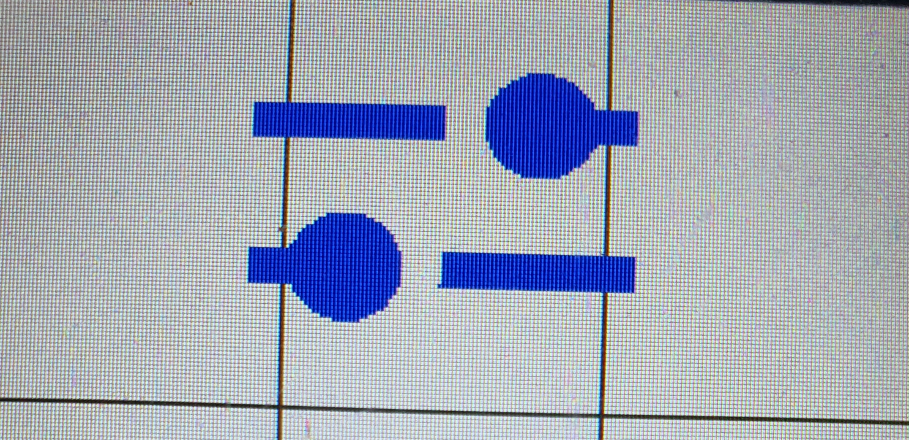

.. _button_blank:

Button_Blank
+++++++++++++++

Beschreibung
=============

Dieses :ref:`Element<element>` ist ein :ref:`Button<button>`. Anders als die anderen Ausprägungen, wird mit ``Button_Blank`` ein Objekt erzeugt, 
dass keine Farbe hat (also sowohl keine Umrandungsfarbe, als auch keine Füllfarbe). Daher eignet sich diese Klasse besonders gut, um :ref:`Items<item>`
auf dem Bildschirm anzuzeigen, die sich wie Buttons/ Switches verhalten sollen. So wäre es z.B. möglich, komplett eigens gestaltete Buttons/ Switches zu erstellen.
(Unterschied zwischen Button und Switch siehe :ref:`Button<button>`)

Beispielbild
=====================

Dieses Bild dient nur der Veranschaulichung, wie Objekte dieser Klasse aussehen können.

.. code-block:: 

    new Button_Blank("icon:slider", COLOR_BLUE, TML_empty_button)

Funktionen
=============

.. csv-table:: 
    :widths: 100 1000

    , ":ref:`Button_Blank<buttonblankconstructorbuttonnolongpress>` (const char* item, const Color& color, const std::function<void()> button_callback, ExternalButtonValue* const value=nullptr)"
    , ":ref:`Button_Blank<buttonblankconstructorbuttonlongpress>` (const char* item, const Color& color, const std::function<void()> button_callback, const std::function<void()> longpress_callback, ExternalButtonValue* const value=nullptr)"
    , ":ref:`Button_Blank<buttonblankconstructorswitchnolongpress>` (const char* item, const Color& color, const std::function<void(bool)> switch_callback, ExternalButtonValue* const value=nullptr)"
    , ":ref:`Button_Blank<buttonblankconstructorswitchlongpress>` (const char* item, const Color& color, const std::function<void(bool)> switch_callback, const std::function<void()> longpress_callback, ExternalButtonValue* const value=nullptr)"
    , ":ref:`~Button_Blank<buttonblankdestructor>` ()"
    bool, ":ref:`checkSize<buttonblankchecksize>` () override"
    void, ":ref:`draw<buttonblankdraw>` () override"
    void, ":ref:`loop<buttonblankloop>` (Inputs& input) override"

Variablen und Konstanten
==========================

.. csv-table:: 
    :widths: 100 1000

    ":ref:`Item*<item>`", ":ref:`item<buttonblankvitem>`"

Funktionen Beschreibung
=========================

.. _buttonblankconstructorbuttonnolongpress:

Button_Blank(const char* item, const Color& color, const std::function<void()> button_callback, ExternalButtonValue* const value=nullptr)
~~~~~~~~~~~~~~~~~~~~~~~~~~~~~~~~~~~~~~~~~~~~~~~~~~~~~~~~~~~~~~~~~~~~~~~~~~~~~~~~~~~~~~~~~~~~~~~~~~~~~~~~~~~~~~~~~~~~~~~~~~~~~~~~~~~~~~~~~~~~~~~~~~~~

.. literalinclude:: ../../src/ElementViews/Button_Blank.cpp
    :lines: 4-8
    :linenos:

Diese Funktion ist ein Konstruktor, der einen leeren Button (keinen Switch) erzeugt. Als Parameter nimmt der Konstruktor den Namen eines :ref:`Items<item>` (``item``), die Farbe des Items (``color``), 
eine Button Callback Funktion (``button_callback``) (siehe :ref:`button_callback<buttonbuttoncallback>`), sowie dem :ref:`ExternalButtonValue*<externalbuttonvalue>` ``value``, der angibt, ob der Button aktiviert ist oder nicht.

In der Initialisierungsliste wird der :ref:`Button<buttonbutton>` Konstruktor aufgerufen, sowie mittels :ref:`createItem<displaycreateitemcolor>` das :ref:`item<buttonblankvitem>` initialisiert. 
Dort wird auch beschrieben, wie die Eingabe des ``char* item`` aussehen soll. 

.. _buttonblankconstructorbuttonlongpress:

Button_Blank(const char* item, const Color& color, const std::function<void()> button_callback, const std::function<void()> longpress_callback, ExternalButtonValue* const value=nullptr)
~~~~~~~~~~~~~~~~~~~~~~~~~~~~~~~~~~~~~~~~~~~~~~~~~~~~~~~~~~~~~~~~~~~~~~~~~~~~~~~~~~~~~~~~~~~~~~~~~~~~~~~~~~~~~~~~~~~~~~~~~~~~~~~~~~~~~~~~~~~~~~~~~~~~~~~~~~~~~~~~~~~~~~~~~~~~~~~~~~~~~~~~~

.. literalinclude:: ../../src/ElementViews/Button_Blank.cpp
    :lines: 10-14
    :linenos:

Diese Funktion ist ein Konstruktor, der einen leeren Button (keinen Switch) erzeugt. Als Parameter nimmt der Konstruktor den Namen eines :ref:`Items<item>` (``item``), die Farbe des Items (``color``), 
eine Button Callback Funktion (``button_callback``) (siehe :ref:`button_callback<buttonbuttoncallback>`), eine Longpress Callback Funktion (``longpress_callback``) (siehe :ref:`longpress_callback<buttonlongpresscallback>`)
sowie dem :ref:`ExternalButtonValue*<externalbuttonvalue>` ``value``, der angibt, ob der Button aktiviert ist oder nicht.

In der Initialisierungsliste wird der :ref:`Button<buttonbuttonlongpress>` Konstruktor aufgerufen, sowie mittels :ref:`createItem<displaycreateitemcolor>` das :ref:`item<buttonblankvitem>` initialisiert. 
Dort wird auch beschrieben, wie die Eingabe des ``char* item`` aussehen soll. 

.. _buttonblankconstructorswitchnolongpress:

Button_Blank(const char* item, const Color& color, const std::function<void(bool)> switch_callback, ExternalButtonValue* const value=nullptr)
~~~~~~~~~~~~~~~~~~~~~~~~~~~~~~~~~~~~~~~~~~~~~~~~~~~~~~~~~~~~~~~~~~~~~~~~~~~~~~~~~~~~~~~~~~~~~~~~~~~~~~~~~~~~~~~~~~~~~~~~~~~~~~~~~~~~~~~~~~~~~~~~~~~~

.. literalinclude:: ../../src/ElementViews/Button_Blank.cpp
    :lines: 17-21
    :linenos:

Diese Funktion ist ein Konstruktor, der einen leeren Switch (keinen Button) erzeugt. Als Parameter nimmt der Konstruktor den Namen eines :ref:`Items<item>` (``item``), die Farbe des Items (``color``), 
eine Switch Callback Funktion (``switch_callback``) (siehe :ref:`switch_callback<buttonswitchcallback>`), sowie dem :ref:`ExternalButtonValue*<externalbuttonvalue>` ``value``, der angibt, ob der Button aktiviert ist oder nicht.

In der Initialisierungsliste wird der :ref:`Button<buttonswitch>` Konstruktor aufgerufen, sowie mittels :ref:`createItem<displaycreateitemcolor>` das :ref:`item<buttonblankvitem>` initialisiert. 
Dort wird auch beschrieben, wie die Eingabe des ``char* item`` aussehen soll. 

.. _buttonblankconstructorswitchlongpress:

Button_Blank(const char* item, const Color& color, const std::function<void(bool)> switch_callback, const std::function<void()> longpress_callback, ExternalButtonValue* const value=nullptr)
~~~~~~~~~~~~~~~~~~~~~~~~~~~~~~~~~~~~~~~~~~~~~~~~~~~~~~~~~~~~~~~~~~~~~~~~~~~~~~~~~~~~~~~~~~~~~~~~~~~~~~~~~~~~~~~~~~~~~~~~~~~~~~~~~~~~~~~~~~~~~~~~~~~~~~~~~~~~~~~~~~~~~~~~~~~~~~~~~~~~~~~~~~~~~~~

.. literalinclude:: ../../src/ElementViews/Button_Blank.cpp
    :lines: 23-27
    :linenos:

Diese Funktion ist ein Konstruktor, der einen leeren Switch (keinen Button) erzeugt. Als Parameter nimmt der Konstruktor den Namen eines :ref:`Items<item>` (``item``), die Farbe des Items (``color``), 
eine Switch Callback Funktion (``switch_callback``) (siehe :ref:`switch_callback<buttonswitchcallback>`), eine Longpress Callback Funktion (``longpress_callback``) (siehe :ref:`longpress_callback<buttonlongpresscallback>`)
sowie dem :ref:`ExternalButtonValue*<externalbuttonvalue>` ``value``, der angibt, ob der Button aktiviert ist oder nicht.

In der Initialisierungsliste wird der :ref:`Button<buttonswitchlongpress>` Konstruktor aufgerufen, sowie mittels :ref:`createItem<displaycreateitemcolor>` das :ref:`item<buttonblankvitem>` initialisiert. 
Dort wird auch beschrieben, wie die Eingabe des ``char* item`` aussehen soll. 

.. _buttonblankdestructor:

~Button_Blank()
~~~~~~~~~~~~~~~~~

.. literalinclude:: ../../src/ElementViews/Button_Blank.cpp
    :lines: 29-31
    :linenos:

Dieser Destruktor löscht das :ref:`item<buttonblankvitem>` Objekt und gibt den allokierten Speicherplatz wieder frei.

.. _buttonblankchecksize:

bool checkSize(uint16_t sizeX, uint16_t sizeY, uint8_t rotation) override
~~~~~~~~~~~~~~~~~~~~~~~~~~~~~~~~~~~~~~~~~~~~~~~~~~~~~~~~~~~~~~~~~~~~~~~~~~

.. literalinclude:: ../../src/ElementViews/Button_Blank.cpp
    :lines: 33-36
    :linenos:

Diese Funktion überprüft, ob Objekte der ``Button_Blank`` Klasse zeichenbar sind, oder ob sie zu groß bzw. zu klein sind, um sie anzuzeigen.
Die Parameter der Funktion sind die Höhe (``sizeY``) und Breite des Objektes (``sizeX``).
Dafür wird die :ref:`setResolution<itemsetresolution>` des :ref:`item<buttonblankvitem>` aufgerufen, um zu bestimmen, wie groß ``item`` auf dem Button angezeigt werden wird.
Anschließend wird überprüft, ob ``item`` entweder breiter oder höher als der Button ist, also ob ``item`` aus dem Button herausragen würde. Ist dies nicht der Fall, wird ``true`` ausgegeben.

.. _buttonblankdraw:

void draw() override
~~~~~~~~~~~~~~~~~~~~~~~~~~~~~~~~~~~~~

.. literalinclude:: ../../src/ElementViews/Button_Blank.cpp
    :lines: 38-41
    :linenos:

Diese Funktion zeichnet Objekte der ``Button_Blank`` Klasse auf :ref:`display<elementvdisplay>`.
Sollte :ref:`value<buttonvvalue>` == ``true`` gelten, so wird ``item`` auf den Button im angeschalteten Zustand gezeichnet. Dafür wird die :ref:`drawOn<itemdrawon>` Funktion verwendet. Mit 
``posX + sizeX/2`` und ``posY + sizeY/2`` wird ``item`` auf die gewünschte Position gezeichnet. Ist :ref:`value<buttonvvalue>` hingegen ``false``, wir mit :ref:`drawOff<itemdrawoff>` das Item 
auf den Button im ausgeschalteten Zustand gezeichnet.

.. _buttonblankloop:

uint16_t loop(Inputs& input) override
~~~~~~~~~~~~~~~~~~~~~~~~~~~~~~~~~~~~~~~

.. literalinclude:: ../../src/ElementViews/Button_Blank.cpp
    :lines: 43-46
    :linenos:

Diese Funktion dient dazu, den Zustand des aktuellen Objektes zu aktualisieren, um auf Benutzereingaben zu reagieren.
Sollte ein :ref:`externalValue<buttonvexternalvalue>` existieren und sollte sich dieser vom :ref:`value<buttonvvalue>` des aktuellen Objektes unterscheiden, wird 
:ref:`input.update<inputvupdate>` ``true`` gesetzt, um die Verfügbarkeit einer Veränderung im Zustand kenntlich zu machen.
Anschließend wird die :ref:`loop<buttonloopinput>` des :ref:`Buttons<button>` aufgerufen, um mögliche Veränderungen umzusetzen.

Variablen und Konstanten Beschreibung
=====================================

.. _buttonblankvitem:

Item* item
~~~~~~~~~~~~~~~~~~~~~~~~~~~~~~~~~~~~~

Gibt das :ref:`Item<item>` des aktuellen Objektes an.