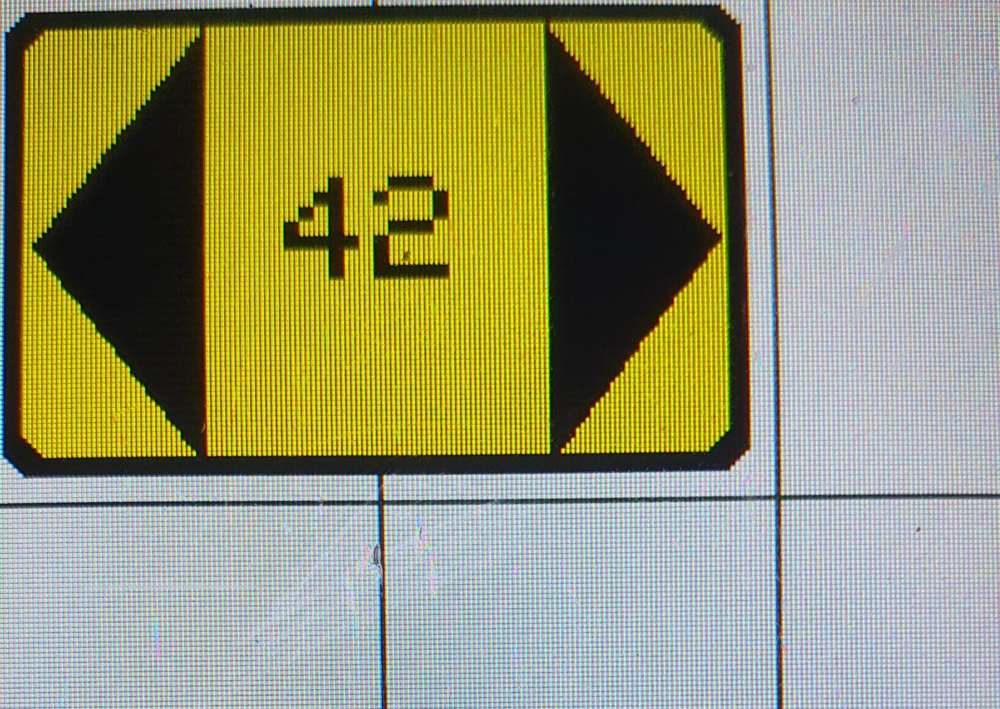

.. _number_counter:

Number_Counter
+++++++++++++++

Beschreibung
=============

Diese Klasse kann Zahlen in einem Intervall hoch- und runterzählen.
Sie erbt von :ref:`Number_Input<numberinput>`.

Beispielbild
=====================
Dieses Bild dient nur der Veranschaulichung, wie Objekte dieser Klasse aussehen können.

.. code-block:: 
    
    new Number_Counter("symb:TriangleLeft", "symb:TriangleRight", COLOR_YELLOW, true, TML_empty_slider, &numberValue)

Funktionen
=============

.. csv-table:: 
    :widths: 100 10000

    inline, ":ref:`Number_Counter <Number_Counterconstructor>` (const char* item1, const char* item2, const Color& color, const bool show_number, const std::function<void(int)> slider_callback, ExternalNumberValue* value=nullptr)"
    inline, ":ref:`~Number_Counter <Number_Counterdestructor>` ()"
    inline void, ":ref:`draw <Number_Counterdraw>` ()"
    inline void, ":ref:`setTouch <Number_Countersettouch>` (Inputs& input) override"
    inline bool, ":ref:`checkSize <Number_Counterchecksize>` (uint16_t sizeX, uint16_t sizeY, uint8_t rotation) override"
    inline void, ":ref:`drawItems <Number_Counterdrawitem>` ()"
    inline void, ":ref:`loop <Number_Counterdraw>` (Inputs& input) override"

Variablen und Konstanten
==========================

.. csv-table:: 
    :widths: 100 10000

    const ":ref:`Color <Color>`", ":ref:`color <Number_Countervcolor>`"
    ":ref:`Item* <item>`", ":ref:`item1 <Number_Countervitem1>`"
    ":ref:`Item* <item>`", ":ref:`item2 <Number_Countervitem2>`"
    const uint16_t, ":ref:`showNumber <number_countervshownumber>` = false"
    const uint16_t, ":ref:`padding <Number_Countervpadding>` = 5"
    const uint16_t, ":ref:`borderStrength <Number_Countervborderstrength>` = 4"
    const uint16_t, ":ref:`borderRadius <Number_Countervborderradius>` = 6"
    const uint16_t, ":ref:`triangleDistance <Number_Countervtriangledistance>` = 1.5*padding + borderStrength"
    const uint16_t, ":ref:`fontSize <Number_Countervfontsize>`"
    uint16_t, ":ref:`triangleHeight <Number_Countervtriangleheight>`"
    bool, ":ref:`isVertical <Number_Countervisvertical>` = false"
    const uint16_t, ":ref:`time <Number_Countervtime>` = 200"
    bool, ":ref:`activateAnimation <Number_Countervactiveanimation>` = true"
    unsigned long, ":ref:`timerTriang1 <Number_Countervtimertriang1>` = 0"
    unsigned long, ":ref:`timerTriang2 <Number_Countervtimertriang2>` = 0"

Funktionen Beschreibung
=========================

.. _Number_CounterConstructor:

inline Number_Counter(const char* item1, const char* item2, const Color& color, const bool show_number, const std::function<void(int)> slider_callback, ExternalNumberValue* value=nullptr)
~~~~~~~~~~~~~~~~~~~~~~~~~~~~~~~~~~~~~~~~~~~~~~~~~~~~~~~~~~~~~~~~~~~~~~~~~~~~~~~~~~~~~~~~~~~~~~~~~~~~~~~~~~~~~~~~~~~~~~~~~~~~~~~~~~~~~~~~~~~~~~~~~~~~~~~~~~~~~~~~~~~~~~~~~~~~~~~~~~~~~~~~~~~~~~~~~~~~~~~~

.. literalinclude:: ../../src/ElementViews/Number_Counter.h
    :lines: 11-17
    :linenos:

Dieser Konstruktor nimmt als Parameter die zwei Strings, die die :ref:`Items<item>` ``item1`` und ``item2`` repräsentieren sollen, die auf dem Objekt als Eingabetaste 
angezeigt werden sollen, eine Farbe ``color`` für die ``Items``, ``showNumber`` um anzugeben, ob der vom Slider eingestellte Zahlenwert angezeigt werden soll oder nicht, 
eine Callback Funktion ``slider_callback`` (siehe :ref:`slider_callback<numberinputvslider_callback>`) und einem ``value``, der angibt, in welchem Zustand sich das Objekt befindet.

In der Initialisierungsliste erfolgt ein Funktionsaufruf vom :ref:`NumberInput<numberinputconstructor>` Konstruktor und die Initialisierung von 
:ref:`color<number_countervcolor>` und :ref:`showNumber<number_countervshownumber>` mit den entsprechenden Parametern. :ref:`item1<number_countervitem1>` wird initialsiert, indem mit 
:ref:`createItem<displaycreateitemcolor>` ein Item aus dem ``item1`` String erstelt wird. Das zweite Argument setzt sich zusammen aus der Hauptitemfarbe :ref:`color.getItemColor<colorgetitemcolor>`
und der Farbe, die aus dem :ref:`Color<colorconstructor5>` Konstruktoraufruf entsteht. Die ``-50`` wird als Argument übergeben, um eine veränderte Farbe als die Ursprungsfarbe zu erhalten.
Für :ref:`item2<number_countervitem2>` läuft die Initialisierung ähnlich ab, nur wird hier stattdessen die Zweititemfarbe :ref:`color.getSecondaryItemColor<colorgetsecondaryitemcolor>` als Basis verwendet.

.. _Number_CounterDestructor:

inline ~Number_Counter()
~~~~~~~~~~~~~~~~~~~~~~~~~~

.. literalinclude:: ../../src/ElementViews/Number_Counter.h
    :lines: 19-22
    :linenos:

Der Destruktor wird bei der Zerstörung eines ``Number_Counter`` Objektes aufgerufen, löscht :ref:`item1<number_countervitem1>` und :ref:`item2<number_countervitem2>` und 
gibt den allokierten Speicherplatz frei.

.. _Number_CounterDraw:

inline void draw()
~~~~~~~~~~~~~~~~~~~~

.. literalinclude:: ../../src/ElementViews/Number_Counter.h
    :lines: 24-34
    :linenos:

Diese Funktion ist für das Zeichnen des Objektes verantwortlich. 

.. literalinclude:: ../../src/ElementViews/Number_Counter.h
    :lines: 26

Zuerst wird mit :ref:`rect_center<displayrectcenterinfill>` ein Rechteck gezeichnet, das als Grundlage für das Objekt dient.    

.. literalinclude:: ../../src/ElementViews/Number_Counter.h
    :lines: 27-31

Sollte :ref:`showNumber<number_countervshownumber>` ``true`` sein, so soll der aktuelle Wert auf dem Objekt angezeigt werden. 
Zunächst wird :ref:`value<numberinputvvalue>` mit ``snprintf`` in einen Puffer (``buffer``) konvertiert, ehe mit :ref:`rect_center<displayrectcenternoinfill>` der Wert in der Mitte des Objektes angezeigt wird.

.. literalinclude:: ../../src/ElementViews/Number_Counter.h
    :lines: 33

Zum Schluss werden die :ref:`drawItems<number_counterdrawitem>` die beiden :ref:`Items<item>` :ref:`item1<number_countervitem1>` und :ref:`item2<number_countervitem2>` 
auf dem Rechteck gezeichnet. Das ``Number_Counter`` Objekt ist fertig.

.. _Number_CounterSetTouch:

inline void setTouch(Inputs& input) override
~~~~~~~~~~~~~~~~~~~~~~~~~~~~~~~~~~~~~~~~~~~~~~~~~~~~~~~~~~~~

.. literalinclude:: ../../src/ElementViews/Number_Counter.h
    :lines: 36-85
    :linenos:

Diese Funktion testet, ob die beiden Eingabetasten berührt werden bzw. welche von ihnen berührt wird.

.. literalinclude:: ../../src/ElementViews/Number_Counter.h
    :lines: 38-40

Zuerst werden einige Variablen deklariert, um die Positionen der beiden Eingabetasten zu speichern. Dabei sind ``rect1_x1``, ``rect1_y1``, ``rect1_x2`` und ``rect1_y2`` die Koordinaten
für die erste Eingabetaste und ``rect2_x1``, ``rect2_y1``, ``rect2_x2`` und ``rect2_y2`` für die zweite Eingabetaste. Um die Positionen zu bestimmen, benötigt man nur zwei Koordinaten, 
da jede Koordinate einen der beiden äußersten Ränder einer Eingabetaste repräsentiert. Wichtig ist nur, dass eventuelle Berührungen innerhalb dieser beiden Ränder stattfinden.
In ``tmp`` wird der aktuelle Wert von :ref:`value<numberinputvvalue>` zwischengespeichert.

.. literalinclude:: ../../src/ElementViews/Number_Counter.h
    :lines: 42-51

Sollte :ref:`isVertical<number_countervisvertical>` ``true`` sein, ist das ``Number_Counter`` Objekt vertikal ausgerichtet und 
dementsprechend werden die oberste und untersten Ränder der Eingabetasten bestimmt.

.. literalinclude:: ../../src/ElementViews/Number_Counter.h
    :lines: 52-62

Andernfalls ist das ``Number_Counter`` Objekt horizontal ausgerichtet und dementsprechend werden die linkesten und rechtesten Ränder der Eingabetasten bestimmt.  

.. literalinclude:: ../../src/ElementViews/Number_Counter.h
    :lines: 64-70

Nun wird geprüft, ob der Touchinput (:ref:`input.touchX<inputvtouchx>` :ref:`input.touchY<inputvtouchy>`) innerhalb des ersten Eingabefelds liegt.
Wenn ja, wird die erste Eingabetaste berührt. Die erste Eingabetaste soll bei Berührung den :ref:`value<numberinputvvalue>` um eins verringern, deswegen wird geprüft, 
ob :ref:`value<numberinputvvalue>` nicht schon den minimalsten Wert (:ref:`minValue<numberinputvminvalue>`) angenommen hat.
Wenn also ``value > minValue`` gilt, wird :ref:`value<numberinputvvalue>` um :ref:`steps<numberinputvsteps>` verringert (außer dieser Wert wäre geringer als 
:ref:`minValue<numberinputvminvalue>`, dann würde :ref:`value<numberinputvvalue>` stattdessen den Wert von :ref:`minValue<numberinputvminvalue>` annehmen).
Sollte :ref:`activateAnimation<number_countervactiveanimation>` gelten, so wird im :ref:`timerTriang1<number_countervtimertriang1>` die Millisekunden seit Start 
(siehe `millis() <https://www.arduino.cc/reference/en/language/functions/time/millis/>`_ ) speichert.

.. literalinclude:: ../../src/ElementViews/Number_Counter.h
    :lines: 72-78

Für die zweite Eingabetaste funktioniert der Ablauf ähnlich wie bei der ersten Eingabetaste, nur sind hier sämtliche Verwendungen von ``min`` und ``max`` getauscht.  

.. literalinclude:: ../../src/ElementViews/Number_Counter.h
    :lines: 80-84

Sollte sich :ref:`value<numberinputvvalue>` im Laufe der Funktion verändert haben, so wird die :ref:`Callbackfunktion<numberinputvslider_callback>` aufgerufen. Sollte es 
einen :ref:`externalValue<numberinputvexternalvalue>` geben, so ersetzt dieser den Wert von :ref:`value<numberinputvvalue>` mit :ref:`setvalue<externalnumbervaluesetvalue>`.
Anschließend wird das veränderte Objekt gezeichnet.  

.. _Number_CounterCheckSize:

inline bool checkSize(uint16_t sizeX, uint16_t sizeY, uint8_t rotation) override
~~~~~~~~~~~~~~~~~~~~~~~~~~~~~~~~~~~~~~~~~~~~~~~~~~~~~~~~~~~~~~~~~~~~~~~~~~~~~~~~~~~~~~~~~~~~~~~~~~~~

.. literalinclude:: ../../src/ElementViews/Number_Counter.h
    :lines: 88-119
    :linenos:

Diese Funktion testet, ob die Höhe (``sizeX``) und Breite (``sizeY``) eines Objektes in einem bestimmten Größenverhältnis zueinander stehen, um das Objekt zeichnen zu können.

.. literalinclude:: ../../src/ElementViews/Number_Counter.h
    :lines: 89-93

Wenn ein Objekt mindestens 1.2 mal so hoch ist, wie es breit ist, dann ist das Objekt :ref:`vertikal<number_countervisvertical>` und zeichenbar.
Sollte :ref:`showNumber<number_countervshownumber>` gelten, so muss ein Objekt 1.4 mal so hoch sein, wie es breit ist.

.. literalinclude:: ../../src/ElementViews/Number_Counter.h
    :lines: 95-96

Anschließend wird :ref:`triangleHeight<number_countervtriangleheight>` berechnet. Sollte :ref:`showNumber<number_countervshownumber>` gelten, wird 
:ref:`triangleHeight<number_countervtriangleheight>` um das zehnfache von :ref:`fontSize<number_countervfontsize>` reduziert, um Platz für das Anzeigen von :ref:`value<numberinputvvalue>` zu schaffen.

.. literalinclude:: ../../src/ElementViews/Number_Counter.h
    :lines: 98-99

Danach wird mit :ref:`setResolution<itemsetresolution>` die Auflösung von :ref:`item1<number_countervitem1>` und :ref:`item2<number_countervitem2>` bestimmt, welche optimal an das Objekt angepasst ist.

.. literalinclude:: ../../src/ElementViews/Number_Counter.h
    :lines: 105

Wenn ein Objekt mindestens 1.2 mal so breit ist, wie es hoch ist, dann ist das Objekt :ref:`horizontal<number_countervisvertical>` und zeichenbar.
Sollte :ref:`showNumber<number_countervshownumber>` gelten, so muss ein Objekt 1.4 mal so breit sein, wie es hoch ist.    
Der restliche Ablauf ähnelt dem aus den vorherigen Absätzen stark, weswegen dieser nicht näher erläutert wird.

.. literalinclude:: ../../src/ElementViews/Number_Counter.h
    :lines: 118

Sollte keine der beiden Bedingungen erfüllt sein, ist das Objekt nicht zeichenbar, da das Seitenverhältnis nicht stimmt.

.. _Number_CounterDrawItem:

inline void drawItems()
~~~~~~~~~~~~~~~~~~~~~~~~~~~~~~~~~~~~~~~~

.. literalinclude:: ../../src/ElementViews/Number_Counter.h
    :lines: 121-144
    :linenos:

Diese Funktion wird verwendet, um :ref:`item1<number_countervitem1>` und :ref:`item2<number_countervitem2>` zu zeichnen.

.. literalinclude:: ../../src/ElementViews/Number_Counter.h
    :lines: 123

``x1`` und ``y1`` stehen für die X- bzw Y-Koordinate, bei denen :ref:`item1<number_countervitem1>` und ``x2`` und ``y2`` für die X- bzw Y-Koordinate, 
bei denen :ref:`item2<number_countervitem2>` gezeichnet werden soll.

.. literalinclude:: ../../src/ElementViews/Number_Counter.h
    :lines: 124-135

Je nachdem, ob das Objekt vertikal oder horizontal ausgerichtet ist (:ref:`isVertical<number_countervisvertical>`), werden die Positionen unterschiedlich berechnet.

.. literalinclude:: ../../src/ElementViews/Number_Counter.h
    :lines: 139-140

Wenn diese Bedingungen gelten, wird für :ref:`item1<number_countervitem1>` die :ref:`drawOn<itemdrawon>` Funktion aufgerufen, da das ``Item`` auf der inkrementierenden Seite dargestellt werden soll, 
andernfalls wird es auf der dekrementierenden Seite gezeichnet.

.. literalinclude:: ../../src/ElementViews/Number_Counter.h
    :lines: 142-143

Wenn diese Bedingungen gelten, wird für :ref:`item2<number_countervitem2>` die :ref:`drawOn<itemdrawon>` Funktion aufgerufen, da das ``Item`` auf der inkrementierenden Seite dargestellt werden soll, 
andernfalls wird es auf der dekrementierenden Seite gezeichnet.

.. _Number_CounterLoop:

inline void loop (Inputs& input) override
~~~~~~~~~~~~~~~~~~~~~~~~~~~~~~~~~~~~~~~~~~~~

.. literalinclude:: ../../src/ElementViews/Number_Counter.h
    :lines: 146-163
    :linenos:

Diese Funktion dient dazu, den Zustand des aktuellen Objektes zu aktualisieren.

.. literalinclude:: ../../src/ElementViews/Number_Counter.h
    :lines: 147

Zuerst wird :ref:`loop<numberinputloopinputs>` Funktion mit ``input`` aufgerufen, um diese auszuführen.

.. literalinclude:: ../../src/ElementViews/Number_Counter.h
    :lines: 150

Sollte :ref:`activateAnimation<number_countervactiveanimation>` ``false`` sein, wird die Funktion abgebrochen, weil keine Änderungen vorgenommen werden müssen.

.. literalinclude:: ../../src/ElementViews/Number_Counter.h
    :lines: 152-156

Hier wird :ref:`timerTriang1<number_countervtimertriang1>` zurückgesetzt und die :ref:`drawItems<number_counterdrawitem>` Funktion aufgerufen, wenn ein Timer gestartet wurde und 
seit Timerstart mehr Millisekunden abgalaufen sind, als in :ref:`time<number_countervtime>` angegeben. Die Animation ist abgelaufen 

.. literalinclude:: ../../src/ElementViews/Number_Counter.h
    :lines: 158-162

Hier wird :ref:`timerTriang2<number_countervtimertriang2>` zurückgesetzt und die :ref:`drawItems<number_counterdrawitem>` Funktion aufgerufen, wenn ein Timer gestartet wurde und 
seit Timerstart mehr Millisekunden abgalaufen sind, als in :ref:`time<number_countervtime>` angegeben. Die Animation ist abgelaufen.

Variablen und Konstanten Beschreibung
=====================================

.. _Number_Countervcolor:

const Color color
~~~~~~~~~~~~~~~~~~~~~~~~~~

Gibt die Farbe eines :ref:`Items <item>` an.

.. _Number_Countervitem1:

Item* item1
~~~~~~~~~~~~~~~~~~~~~~~~~~

Eines von zwei möglichen :ref:`Items <item>`, die auf Objekten der ``number_counter`` Klasse angezeigt werden können. 
Dieses Item ist die grafische Darstellung einer Eingabetaste, die beim Betätigen :ref:`value<numberinputvvalue>` reduzieren soll.

.. _Number_Countervitem2:

Item* item2
~~~~~~~~~~~~~~~~~~~~~~~~~~

Eines von zwei möglichen :ref:`Items <item>`, die auf Objekten der ``number_counter`` Klasse angezeigt werden können.
Dieses Item ist die grafische Darstellung einer Eingabetaste, die beim Betätigen :ref:`value<numberinputvvalue>` erhöhen soll.

.. _Number_Countervshownumber:

const bool showNumber = false
~~~~~~~~~~~~~~~~~~~~~~~~~~~~~~~~~~~~~~~~

Gibt an, ob die eingestellte Zahl die (siehe :ref:`value<numberinputvvalue>`) 
auf dem Bildschirm angezeigt werden (``showNumber = true``) oder versteckt bleiben soll (``showNumber = false``)

.. _Number_Countervpadding:

const uint16_t padding = 5
~~~~~~~~~~~~~~~~~~~~~~~~~~~~~~~~~~~~~~~~

Gibt den Abstand zur Umrandung an.

.. _Number_Countervborderstrength:

const uint16_t borderStrength = 4
~~~~~~~~~~~~~~~~~~~~~~~~~~~~~~~~~~~~~~~~

Gibt die Breite der Umrandung an.

.. _Number_Countervborderradius:

const uint16_t borderRadius = 6
~~~~~~~~~~~~~~~~~~~~~~~~~~~~~~~~~~~~~~~~

Gibt den Radius der Umrandung (bzw. den Krümmungsgrad) an.

.. _Number_Countervtriangledistance:

const uint16_t triangleDistance = 1.5*padding + borderStrength
~~~~~~~~~~~~~~~~~~~~~~~~~~~~~~~~~~~~~~~~~~~~~~~~~~~~~~~~~~~~~~~~~~~~~~~~~~~~~~~~

Gibt an, wie weit die beiden Eingabetasten (mit denen die Werte des Sliders verändert werden können) auseinander sein sollen.

.. _Number_Countervfontsize:

const uint8_t fontSize = 3
~~~~~~~~~~~~~~~~~~~~~~~~~~~

Gibt die Schriftgröße an.

.. _Number_Countervtriangleheight: 

uint16_t triangleHeight
~~~~~~~~~~~~~~~~~~~~~~~~~~~~~~~~~~~~~~~~

Gibt an, wie hoch die beiden Eingabetasten (mit denen die Werte des Sliders verändert werden können) sind.

.. _Number_Countervisvertical:

bool isVertical = false
~~~~~~~~~~~~~~~~~~~~~~~~~~~~~~~~~~~~~~~~

Gibt an, ob das Objekt horizontal oder vertikal ist.

.. _Number_Countervtime:

const uint16_t time = 200
~~~~~~~~~~~~~~~~~~~~~~~~~~~~~~~~~~~~~~~~

Gibt die Animationsdauer an.

.. _Number_Countervactiveanimation:

bool activateAnimation = true
~~~~~~~~~~~~~~~~~~~~~~~~~~~~~~~~~~~~~~~~

Gibt an, ob gerade eine Animation ausgeführt wird.

.. _Number_Countervtimertriang1:

unsigned long timerTriang1 = 0
~~~~~~~~~~~~~~~~~~~~~~~~~~~~~~~~~~~~~~~~

Speichert einen Timer für :ref:`item1<number_countervitem1>`.

.. _Number_Countervtimertriang2:

unsigned long timerTriang2 = 0
~~~~~~~~~~~~~~~~~~~~~~~~~~~~~~~~~~~~~~~~

Speichert einen Timer für :ref:`item2<number_countervitem2>`.