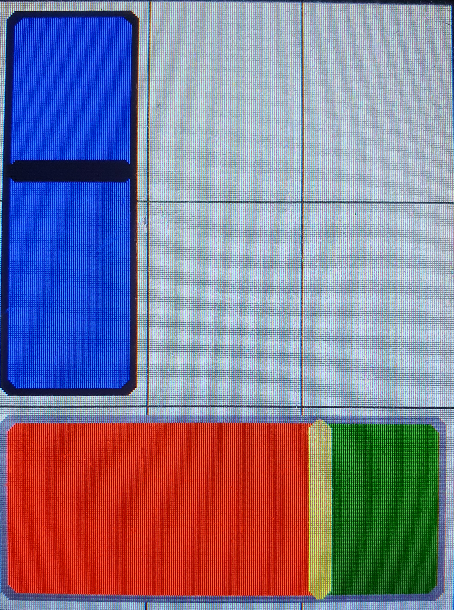

.. _number_slider:

Number_Slider
++++++++++++++

Beschreibung
=============

Diese Klasse ermöglicht das Erstellen von einfachen Schiebereglern.
Sie erbt von :ref:`Number_Input<numberinput>`.

Beispielbild
=====================

Diese Bild dient nur der Veranschaulichung, wie Objekte dieser Klasse aussehen können.

.. code-block:: 

    new Number_Slider(COLOR_BLUE, TML_empty_slider, &numberValue2)

    new Number_Slider((COLOR_RED|COLOR_LIGHT_YELLOW|COLOR_GRAY) + COLOR_DARK_GREEN, TML_empty_slider, &numberValue)

Funktionen
=============

.. csv-table:: 
    :widths: 100 10000

    inline, ":ref:`Number_Slider <Number_Sliderconstructor>` (const Color& color, const std::function<void(int)> slider_callback, ExternalNumberValue* value=nullptr)"
    inline void, ":ref:`draw <Number_Sliderdraw>` ()"
    inline void, ":ref:`setTouch <Number_SliderSetTouch>` (Inputs& input) override"
    inline bool, ":ref:`checkSize <Number_SliderSetTouch>` (uint16_t sizeX, uint16_t sizeY, uint8_t rotation) override"

Variablen und Konstanten
==========================

.. csv-table:: 
    :widths: 100 10000

    const ":ref:`Color <Color>`", ":ref:`color <Number_Slidervcolor>`"
    bool, ":ref:`isVertical <Number_Slidervisvertical>` = false"
    const uint16_t, ":ref:`t <Number_SlidervT>` = 5"
    const uint16_t, ":ref:`b <Number_SlidervB>` = 4"
    const uint16_t, ":ref:`r <Number_SlidervR>` = 6"

Funktionen Beschreibung
=========================

.. _Number_SliderConstructor:

inline Number_Slider(const Color& color, const std::function<void(int)> slider_callback, ExternalNumberValue* value=nullptr)
~~~~~~~~~~~~~~~~~~~~~~~~~~~~~~~~~~~~~~~~~~~~~~~~~~~~~~~~~~~~~~~~~~~~~~~~~~~~~~~~~~~~~~~~~~~~~~~~~~~~~~~~~~~~~~~~~~~~~~~~~~~~~~~~~~~~~~~~~~~~~~~~~~~~~~~~~~~~~~~~~~~~~~~~~~~~~~~~~~~~~~~~~~~~~~~~~~~~~~~~~~~~~~~~~~~~~~~~~~~~~~~~~~~~~~~~~~~~~~~~~~~~~~~~~~~~~~~~~~~~~~~~~~~~~~~~~~~~~~~~~~~~~~~~~~~~~~~~~~~~~~~~~~~~~~~~~~~~~~~~~~~~~~~~~~~~~~~~~~~~~~~~~~~~~~~~~~~~~~~~~~~~~~~~~~~~~~~~
.. literalinclude:: ../../src/ElementViews/Number_Slider.h
    :lines: 10-16
    :linenos:

Diese Funktion ist ein Konstruktor, der einen rechteckigen Slider erzeugt. 
Als Parameter nimmt der Konstruktor eine :ref:`Farbe<color>` (``color``), die ":ref:`Callback<numberinputvslider_callback>`" Funktion ``slider_callback`` und einem ``value``, der angibt, ob das Objekt aktiviert oder deaktiviert ist.

In der Initialisierungsliste erfolgt zuerst der Aufruf vom ":ref:`NumberInput Konstruktor<numberinputconstructor>`".
Außerdem erfolgt die Initialisierung von :ref:`color<Number_Slidervcolor>` mit dem entsprechenden Parameter.

.. _Number_SliderDraw:

inline void draw();
~~~~~~~~~~~~~~~~~~~~~~~~~~~~~~~~~~~~~~~~~~~
.. literalinclude:: ../../src/ElementViews/Number_Slider.h
    :lines: 18-37
    :linenos:

Diese Funktion zeichnet Objekte der ``Number_Slider`` Klasse. Für den Zeichenprozess ist es relevant, ob das Objekt vertikal oder horizontal ausgerichtet 
ist (:ref:`isVertical<Number_Slidervisvertical>`).

.. literalinclude:: ../../src/ElementViews/Number_Slider.h
    :lines: 20-27

Sollte ``isVertical==true`` gelten, soll das Objekt auch vertikal gezeichnet werden. Dafür wird zuerst die Variable ``sy`` erstellt, welche den Wert von :ref:`sizeY<elementvsizey>` annimmt 
abzüglich der Breite der Umrandung (":ref:`b<Number_Slidervb>`") und dem Abstand zur Umrandung (":ref:`t<Number_Slidervt>`"). Beide werden mit ``2`` multipliziert, da sich 
die Umrandung auf beiden Seiten des Elements befindet. Mit ``sliderPos`` wird die Y-Koordinate des Schiebereglers berechnet, bei welcher sich der Regler momentan befindet.
Zuerst zeichnent wir mit dem Funktionsaufruf von ":ref:`rect_center<displayrectcenterinfill>`" auf dem ":ref:`display<elementvdisplay>`" Objekt den deaktivierten Bereich des
Sliders, um dann beim ":ref:`rect<displayrectinfill>`" Funktionsaufruf den aktivierten Bereich des Sliders über Teile des deaktivierten Bereichs überzuzeichnen.
Schließlich wird durch den folgenden ":ref:`rect_center<displayrectcenterinfill>`" Funktionsaufruf der Schieberegler zwischen dem aktivierten und deaktivierten Bereich gezeichnet.

.. literalinclude:: ../../src/ElementViews/Number_Slider.h
    :lines: 28-36

Sollte ``isVertical==false`` gelten, soll das Objekt horizontal statt vertikal gezeichnet werden. Der prinzipielle Ablauf bleibt aber der selbe.

.. _Number_SliderSetTouch:

inline void setTouch(Inputs& input) override;
~~~~~~~~~~~~~~~~~~~~~~~~~~~~~~~~~~~~~~~~~~~~~~~~~~~~~~~~~~~~~~~~~~~~~~~~~~~~~~~~~~~~~~
.. literalinclude:: ../../src/ElementViews/Number_Slider.h
    :lines: 39-62
    :linenos:

Um den Schieberegler des ``Number_Slider`` Objekts auch verschieben zu können, muss mit dieser Funktion ermittelt werden, ob und wo der Benutzer das Objekt berührt.
Die Parameter ``x`` und ``y`` geben an, wo ":ref:`Display<display>`" berührt wird.

.. literalinclude:: ../../src/ElementViews/Number_Slider.h
    :lines: 42-46

| Zuerst werden einige Variablen definiert, die den Code leserlicher machen sollen:
| ``x1`` entspricht der X-Koordinate, bei dem das Objekt anfängt.
| ``xr`` entspricht der X-Koordinate, bei dem das Objekt endet.
| ``y1`` entspricht der Y-Koordinate, bei dem das Objekt anfängt.
| ``yr`` entspricht der Y-Koordinate, bei dem das Objekt endet.

.. literalinclude:: ../../src/ElementViews/Number_Slider.h
    :lines: 48-49

Sollte sich ``y`` nicht zwischen ``y1`` und ``yr`` befinden, wird das Objekt nicht berührt und der Schieberegler wird nicht angepasst. Selbiges gilt, wenn    
``x`` sich nicht zwischen ``x1`` und ``xr`` befindet. Andernfalls wird das Objekt berührt.

.. literalinclude:: ../../src/ElementViews/Number_Slider.h
    :lines: 50-52

Bei einem vertikalen (:ref:`isVertical<Number_Slidervisvertical>`) Objekt, muss nur die Y-Koordinate des Schiebereglers beachtet werden, da dieser sich von oben nach unten bzw. umgekehrt bewegen lässt.
Dafür wird für :ref:`value<numberinputvvalue>` die neue Y-Koordinate des Reglerposition gespeichert.

.. literalinclude:: ../../src/ElementViews/Number_Slider.h
    :lines: 53-56

Bei einem horizontalen (:ref:`isVertical<Number_Slidervisvertical>`) Objekt, muss nur die X-Koordinate des Schiebereglers beachtet werden, da dieser sich von rechts nach links bzw. umgekehrt bewegen lässt.  
Dafür wird für :ref:`value<numberinputvvalue>` die neue X-Koordinate der Reglerposition gespeichert.

.. literalinclude:: ../../src/ElementViews/Number_Slider.h
    :lines: 57-58

Sollte ":ref:`externalValue<numberinputvexternalvalue>`" nicht ``null`` sein, so wird er mit dem neuen ":ref:`value<numberinputvvalue>`" aktualisiert.
Anschließend wird die ":ref:`Callback Funktion<numberinputvslider_callback>`" aufgerufen.

.. literalinclude:: ../../src/ElementViews/Number_Slider.h
    :lines: 60

Zum Schluss folgt ein Aufruf der ":ref:`draw<Number_Sliderdraw>`" Funktion, um die neue Schiebereglerposition zu zeichnen.

.. _Number_SliderCheckSize:

inline bool checkSize(uint16_t sizeX, uint16_t sizeY, uint8_t rotation) override;
~~~~~~~~~~~~~~~~~~~~~~~~~~~~~~~~~~~~~~~~~~~~~~~~~~~~~~~~~~~~~~~~~~~~~~~~~~~~~~~~~~~~~~
.. literalinclude:: ../../src/ElementViews/Number_Slider.h
    :lines: 65-79
    :linenos:

Diese Funktion testet, ob die Höhe (``sizeX``) und Breite (``sizeY``) eines Objektes in einem bestimmten Größenverhältnis zueinander stehen, um das Objekt zeichnen zu können.

.. literalinclude:: ../../src/ElementViews/Number_Slider.h
    :lines: 66-70

Wenn ein Objekt mindestens 1.5 mal so hoch ist, wie es breit ist, dann ist das Objekt ":ref:`vertikal<Number_Slidervisvertical>`" und zeichenbar.

.. literalinclude:: ../../src/ElementViews/Number_Slider.h
    :lines: 72-75

Wenn ein Objekt mindestens 1.5 mal so breit ist, wie es hoch ist, dann ist das Objekt :ref:`horizontal<Number_Slidervisvertical>` und zeichenbar.

.. literalinclude:: ../../src/ElementViews/Number_Slider.h
    :lines: 77-78

Stimmt das Verhältnis nicht, ist das Objekt weder vertikal noch horizontal.    

Variablen und Konstanten Beschreibung
=====================================

.. _Number_SliderVColor:

const Color color
~~~~~~~~~~~~~~~~~~~~~~~~~~~~~

Gibt die Farbe (:ref:`Color<color>`) des Objektes an.

.. _Number_SliderVisvertical:

bool isVertical = false;
~~~~~~~~~~~~~~~~~~~~~~~~~

Gibt an, ob das Objekt horizontal oder vertikal ist. 

.. _Number_SliderVT:

const uint16_t t = 10
~~~~~~~~~~~~~~~~~~~~~~~~~

Gibt den Abstand zur Umrandung an.

.. _Number_SliderVB:

const uint16_t b = 10 
~~~~~~~~~~~~~~~~~~~~~~~~~~

Gibt die Breite der Umrandung an.

.. _Number_SliderVR:

const uint16_t r = 6
~~~~~~~~~~~~~~~~~~~~~~~~

Gibt den Radius der Umrandung (bzw. den Krümmungsgrad) an.
