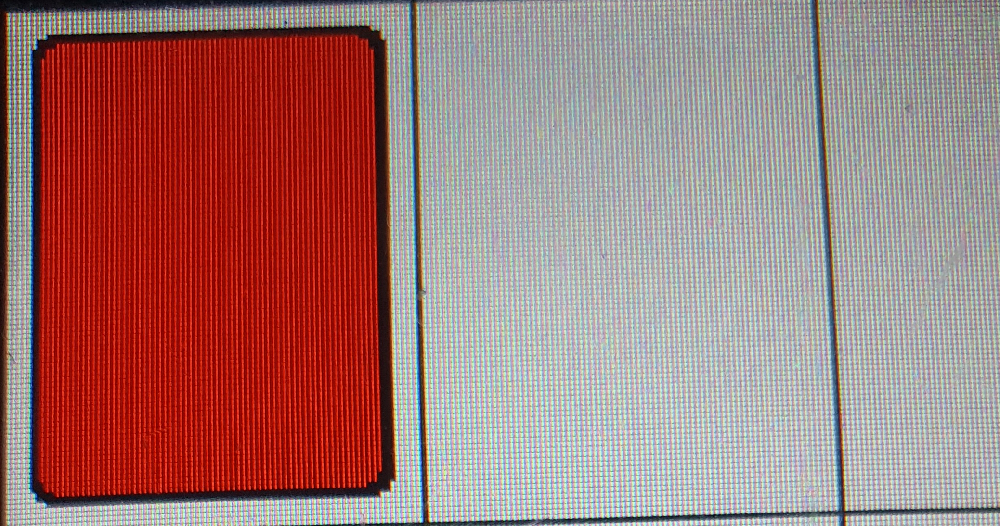
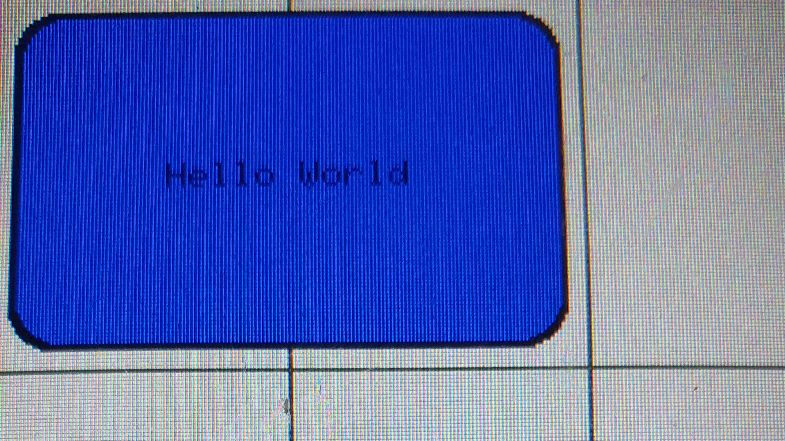

.. _rectbutton:

Button_Rect
+++++++++++++

Beschreibung
=============

Diese Klasse erzeugt :ref:`Button<button>` in rechteckiger Form. Dabei können die Ecken auch abgerundet sein.

Beispielbilder
=====================

Diese Bilder dienen nur der Veranschaulichung, wie Objekte dieser Klasse aussehen können.

.. code-block:: 

    new Button_Rect("", COLOR_GREEN + COLOR_RED, 2, 4, TML_empty_switch)

.. code-block:: 

    new Button_Rect("Hello World", COLOR_BLUE, 2, 12, TML_empty_button)

Funktionen
=============

.. csv-table:: 
    :widths: 100 1000

    , ":ref:`RectButton<rectbuttonconstructorbuttonitemonoff>` (const char* itemOn, const char* itemOff, const Color& color, const uint8_t borderSize, const uint8_t borderRadius, const std::function<void()> button_callback, ExternalButtonValue* const value)"
    , ":ref:`RectButton<rectbuttonconstructorbuttonitemonofflongpress>` (const char* itemOn, const char* itemOff, const Color& color, const uint8_t borderSize, const uint8_t borderRadius, const std::function<void()> button_callback, const std::function<void()> longpress_callback, ExternalButtonValue* const value))"
    , ":ref:`RectButton<rectbuttonconstructorswitchitemonoff>` (const char* itemOn, const char* itemOff, const Color& color, const uint8_t borderSize, const uint8_t borderRadius, const std::function<void(bool)> switch_callback, ExternalButtonValue* const value)"
    , ":ref:`RectButton<rectbuttonconstructorswitchitemonofflongpress>` (const char* itemOn, const char* itemOff, const Color& color, const uint8_t borderSize, const uint8_t borderRadius, const std::function<void(bool)> switch_callback, const std::function<void()> longpress_callback, ExternalButtonValue* const value)"
    , ":ref:`RectButton<rectbuttonconstructorbuttonitem>` (const char* item, const Color& color, const uint8_t borderSize, const uint8_t borderRadius, const std::function<void()> button_callback, ExternalButtonValue* const value)"
    , ":ref:`RectButton<rectbuttonconstructorbuttonitemlongpress>` (const char* item, const Color& color, const uint8_t borderSize, const uint8_t borderRadius, const std::function<void()> button_callback, const std::function<void()> longpress_callback, ExternalButtonValue* const value)"
    , ":ref:`RectButton<rectbuttonconstructorswitchitem>` (const char* item, const Color& color, const uint8_t borderSize, const uint8_t borderRadius, const std::function<void(bool)> switch_callback, ExternalButtonValue* const value)"
    , ":ref:`RectButton<rectbuttonconstructorswitchitemlongpress>` (const char* item, const Color& color, const uint8_t borderSize, const uint8_t borderRadius, const std::function<void(bool)> switch_callback, const std::function<void()> longpress_callback, ExternalButtonValue* const value)"
    , ":ref:`~RectButton<rectbuttondestructor>` ()"
    void, ":ref:`draw<rectbuttondraw>` () override"
    uint16_t, ":ref:`getHeight<rectbuttongetheight>` ()"
    uint16_t, ":ref:`getWidth<rectbuttongetwidth>` ()"
    bool, ":ref:`checkSize<rectbuttonchecksize>` () override"

Variablen und Konstanten
==========================

.. csv-table:: 
    :widths: 100 1000

    const ":ref:`Color<color>`", ":ref:`color <rectbuttonvcolor>`"
    ":ref:`Item*<item>`", ":ref:`itemOn<rectbuttonvitemon>`"
    ":ref:`Item*<item>`", ":ref:`itemOff<rectbuttonvitemoff>`"
    const uint8_t, ":ref:`borderRadius<rectbuttonvborderradius>`"
    const uint8_t, ":ref:`borderSize<rectbuttonvbordersize>`"

Funktionen Beschreibung
=========================

.. _rectbuttonconstructorbuttonitemonoff:

RectButton(const char* itemOn, const char* itemOff, const Color& color, const uint8_t borderSize, const uint8_t borderRadius, const std::function<void()> button_callback, ExternalButtonValue* const value)
~~~~~~~~~~~~~~~~~~~~~~~~~~~~~~~~~~~~~~~~~~~~~~~~~~~~~~~~~~~~~~~~~~~~~~~~~~~~~~~~~~~~~~~~~~~~~~~~~~~~~~~~~~~~~~~~~~~~~~~~~~~~~~~~~~~~~~~~~~~~~~~~~~~~~~~~~~~~~~~~~~~~~~~~~~~~~~~~~~~~~~~~~~~~~~~~~~~~~~~~~~~~~~~~~~~~~~~~~~~~~~

.. literalinclude:: ../../src/ElementViews/Button_Rect.cpp
    :lines: 4-11
    :linenos:

Diese Funktion ist ein Konstruktor, der einen eckigen Button (keinen Switch) erzeugt. Als Parameter nimmt der Konstruktor einen String für ein Erzeugung eines :ref:`Item<item>`
für die aktivierte (``itemOn``) und deaktivierte (``itemOff``) Form des Buttons, eine Farbe (``color``), die Breite der Umrandung (``borderSize``),
den gewünschten Krümmungsradius der Ecken (``borderRadius``), eine Button Callback Funktion (``button_callback``) (siehe :ref:`button_callback<buttonbuttoncallback>`), 
sowie dem ``value``, der angibt, ob der Button aktiviert ist oder nicht.

In der Initialisierungsliste wird zum einen dieser :ref:`Button Konstruktor<buttonbutton>` aufgerufen, zum anderen erfolgt die Initialisierung von :ref:`color<rectbuttonvcolor>`, :ref:`borderRadius<rectbuttonvborderradius>` und  
:ref:`borderSize<rectbuttonvbordersize>` mit den korrespondierenden Parametern. 
Für die Initialisierung von :ref:`itemOn<rectbuttonvitemon>` erfolgt ein Funktionsaufruf von :ref:`createItem<displaycreateitemnocolor>` mit ``itemOn`` und 
:ref:`color.getItemColor()<colorgetitemcolor>` und für :ref:`itemOff<rectbuttonvitemoff>` erfolgt ebenfalls 
ein Funktionsaufruf von :ref:`createItem<displaycreateitemnocolor>`, aber diesmal mit ``ItemOff`` und :ref:`color.getItemColor()<colorgetsecondaryitemcolor>`.

.. _rectbuttonconstructorbuttonitemonofflongpress:

RectButton(const char* itemOn, const char* itemOff, const Color& color, const uint8_t borderSize, const uint8_t borderRadius, const std::function<void()> button_callback, const std::function<void()> longpress_callback, ExternalButtonValue* const value)
~~~~~~~~~~~~~~~~~~~~~~~~~~~~~~~~~~~~~~~~~~~~~~~~~~~~~~~~~~~~~~~~~~~~~~~~~~~~~~~~~~~~~~~~~~~~~~~~~~~~~~~~~~~~~~~~~~~~~~~~~~~~~~~~~~~~~~~~~~~~~~~~~~~~~~~~~~~~~~~~~~~~~~~~~~~~~~~~~~~~~~~~~~~~~~~~~~~~~~~~~~~~~~~~~~~~~~~~~~~~~~~~~~~~~~~~~~~~~~~~~~~~~~~~~~~~~~~~~~~~~~~~~~~~~~~~~~

.. literalinclude:: ../../src/ElementViews/Button_Rect.cpp
    :lines: 13-20
    :linenos:

Diese Funktion ist ein Konstruktor, der einen eckigen Button (keinen Switch) erzeugt. Als Parameter nimmt der Konstruktor einen String für ein Erzeugung eines :ref:`Item<item>`
für die aktivierte (``itemOn``) und deaktivierte (``itemOff``) Form des Buttons, eine Farbe (``color``), die Breite der Umrandung (``borderSize``),
den gewünschten Krümmungsradius der Ecken (``borderRadius``), eine Button Callback Funktion (``button_callback``) (siehe :ref:`button_callback<buttonbuttoncallback>`), 
eine Longpress Callback Funktion (``longpress_callback``) (siehe :ref:`longpress_callback<buttonlongpresscallback>`), sowie dem ``value``, der angibt, ob der Button aktiviert ist oder nicht.

In der Initialisierungsliste wird zum einen dieser :ref:`Button Konstruktor<buttonbuttonlongpress>` aufgerufen, zum anderen erfolgt die Initialisierung von :ref:`color<rectbuttonvcolor>`, :ref:`borderRadius<rectbuttonvborderradius>` und   
:ref:`borderSize<rectbuttonvbordersize>` mit den korrespondierenden Parametern. 
Für die Initialisierung von :ref:`itemOn<rectbuttonvitemon>` erfolgt ein Funktionsaufruf von :ref:`createItem<displaycreateitemnocolor>` mit ``itemOn`` und 
:ref:`color.getItemColor()<colorgetitemcolor>` und für :ref:`itemOff<rectbuttonvitemoff>` erfolgt ebenfalls 
ein Funktionsaufruf von :ref:`createItem<displaycreateitemnocolor>`, aber diesmal mit ``ItemOff`` und :ref:`color.getItemColor()<colorgetsecondaryitemcolor>`.

.. _rectbuttonconstructorswitchitemonoff:

RectButton(const char* itemOn, const char* itemOff, const Color& color, const uint8_t borderSize, const uint8_t borderRadius, const std::function<void(bool)> switch_callback, ExternalButtonValue* const value)
~~~~~~~~~~~~~~~~~~~~~~~~~~~~~~~~~~~~~~~~~~~~~~~~~~~~~~~~~~~~~~~~~~~~~~~~~~~~~~~~~~~~~~~~~~~~~~~~~~~~~~~~~~~~~~~~~~~~~~~~~~~~~~~~~~~~~~~~~~~~~~~~~~~~~~~~~~~~~~~~~~~~~~~~~~~~~~~~~~~~~~~~~~~~~~~~~~~~~~~~~~~~~~~~~~~~~~~~~~~~~~~~~~~~~~~~~~~~~~~~~~~~~~~~~~~~~~~~~~~~~~~~~~~~~~~~~~~~~~~~~~~~~~~~~~~~~~~~

.. literalinclude:: ../../src/ElementViews/Button_Rect.cpp
    :lines: 22-29
    :linenos:

Diese Funktion ist ein Konstruktor, der einen eckigen Switch (keinen Button) erzeugt. Als Parameter nimmt der Konstruktor einen String für ein Erzeugung eines :ref:`Item<item>`
für die aktivierte (``itemOn``) und deaktivierte (``itemOff``) Form des Switches, eine Farbe (``color``), die Breite der Umrandung (``borderSize``),
den gewünschten Krümmungsradius der Ecken (``borderRadius``), eine Switch Callback Funktion (``switch_callback``) (siehe :ref:`switch_callback<buttonswitchcallback>`), 
sowie dem ``value``, der angibt, ob der Switch aktiviert ist oder nicht.

In der Initialisierungsliste wird zum einen dieser :ref:`Button Konstruktor<buttonswitch>` aufgerufen, zum anderen erfolgt die Initialisierung von :ref:`color<rectbuttonvcolor>`, :ref:`borderRadius<rectbuttonvborderradius>` und  
:ref:`borderSize<rectbuttonvbordersize>` mit den korrespondierenden Parametern. 
Für die Initialisierung von :ref:`itemOn<rectbuttonvitemon>` erfolgt ein Funktionsaufruf von :ref:`createItem<displaycreateitemnocolor>` mit ``itemOn`` und 
:ref:`color.getItemColor()<colorgetitemcolor>` und für :ref:`itemOff<rectbuttonvitemoff>` erfolgt ebenfalls 
ein Funktionsaufruf von :ref:`createItem<displaycreateitemnocolor>`, aber diesmal mit ``ItemOff`` und :ref:`color.getItemColor()<colorgetsecondaryitemcolor>`.

.. _rectbuttonconstructorswitchitemonofflongpress:

RectButton(const char* itemOn, const char* itemOff, const Color& color, const uint8_t borderSize, const uint8_t borderRadius, const std::function<void(bool)> switch_callback, const std::function<void()> longpress_callback, ExternalButtonValue* const value)
~~~~~~~~~~~~~~~~~~~~~~~~~~~~~~~~~~~~~~~~~~~~~~~~~~~~~~~~~~~~~~~~~~~~~~~~~~~~~~~~~~~~~~~~~~~~~~~~~~~~~~~~~~~~~~~~~~~~~~~~~~~~~~~~~~~~~~~~~~~~~~~~~~~~~~~~~~~~~~~~~~~~~~~~~~~~~~~~~~~~~~~~~~~~~~~~~~~~~~~~~~~~~~~~~~~~~~~~~~~~~~~~~~~~~~~~~~~~~~~~~~~~~~~~~~~~~~~~~~~

.. literalinclude:: ../../src/ElementViews/Button_Rect.cpp
    :lines: 31-38
    :linenos:

Diese Funktion ist ein Konstruktor, der einen eckigen Switch (keinen Button) erzeugt. Als Parameter nimmt der Konstruktor einen String für ein Erzeugung eines :ref:`Item<item>`
für die aktivierte (``itemOn``) und deaktivierte (``itemOff``) Form des Switches, eine Farbe (``color``), die Breite der Umrandung (``borderSize``),
den gewünschten Krümmungsradius der Ecken (``borderRadius``), eine Switch Callback Funktion (``switch_callback``) (siehe :ref:`switch_callback<buttonswitchcallback>`), 
eine Longpress Callback Funktion (``longpress_callback``) (siehe :ref:`longpress_callback<buttonlongpresscallback>`), sowie dem ``value``, der angibt, ob der Button aktiviert ist oder nicht.

In der Initialisierungsliste wird zum einen dieser :ref:`Button Konstruktor<buttonswitchlongpress>` aufgerufen, zum anderen erfolgt die Initialisierung von :ref:`color<rectbuttonvcolor>`, :ref:`borderRadius<rectbuttonvborderradius>` und   
:ref:`borderSize<rectbuttonvbordersize>` mit den korrespondierenden Parametern. 
Für die Initialisierung von :ref:`itemOn<rectbuttonvitemon>` erfolgt ein Funktionsaufruf von :ref:`createItem<displaycreateitemnocolor>` mit ``itemOn`` und 
:ref:`color.getItemColor()<colorgetitemcolor>` und für :ref:`itemOff<rectbuttonvitemoff>` erfolgt ebenfalls 
ein Funktionsaufruf von :ref:`createItem<displaycreateitemnocolor>`, aber diesmal mit ``ItemOff`` und :ref:`color.getItemColor()<colorgetsecondaryitemcolor>`.

.. _rectbuttonconstructorbuttonitem:

RectButton(const char* item, const Color& color, const uint8_t borderSize, const uint8_t borderRadius, const std::function<void()> button_callback, ExternalButtonValue* const value)
~~~~~~~~~~~~~~~~~~~~~~~~~~~~~~~~~~~~~~~~~~~~~~~~~~~~~~~~~~~~~~~~~~~~~~~~~~~~~~~~~~~~~~~~~~~~~~~~~~~~~~~~~~~~~~~~~~~~~~~~~~~~~~~~~~~~~~~~~~~~~~~~~~~~~~~~~~~~~~~~~~~~~~~~~~~~~~~~~~~~~~~~~~~~~~~~~~~~~~~~~~~~~~~~~~~~~~~~~~~~~~

.. literalinclude:: ../../src/ElementViews/Button_Rect.cpp
    :lines: 40-47
    :linenos:

Diese Funktion ist ein Konstruktor, der einen eckigen Button (keinen Switch) erzeugt. Als Parameter nimmt der Konstruktor einen String für ein Erzeugung eines :ref:`Items<item>`, 
welche für sowohl die aktivierte und deaktivierte Form des Buttons verwendet wird (``item``), eine Farbe (``color``), die Breite der Umrandung (``borderSize``),
den gewünschten Krümmungsradius der Ecken (``borderRadius``), eine Button Callback Funktion (``button_callback``) (siehe :ref:`button_callback<buttonbuttoncallback>`), 
sowie dem ``value``, der angibt, ob der Button aktiviert ist oder nicht.

In der Initialisierungsliste wird zum einen dieser :ref:`Button Konstruktor<buttonbutton>` aufgerufen, zum anderen erfolgt die Initialisierung von :ref:`color<rectbuttonvcolor>`, :ref:`borderRadius<rectbuttonvborderradius>` und  
:ref:`borderSize<rectbuttonvbordersize>` mit den korrespondierenden Parametern. 
Für die Initialisierung von :ref:`itemOn<rectbuttonvitemon>` erfolgt ein Funktionsaufruf von :ref:`createItem<displaycreateitemnocolor>` mit ``item`` und 
:ref:`color.getItemColor()<colorgetitemcolor>` und für :ref:`itemOff<rectbuttonvitemoff>` erfolgt ebenfalls 
ein Funktionsaufruf von :ref:`createItem<displaycreateitemnocolor>`, aber diesmal mit ``item`` und :ref:`color.getItemColor()<colorgetsecondaryitemcolor>`.

.. _rectbuttonconstructorbuttonitemlongpress:

RectButton(const char* item, const Color& color, const uint8_t borderSize, const uint8_t borderRadius, const std::function<void()> button_callback, const std::function<void()> longpress_callback, ExternalButtonValue* const value)
~~~~~~~~~~~~~~~~~~~~~~~~~~~~~~~~~~~~~~~~~~~~~~~~~~~~~~~~~~~~~~~~~~~~~~~~~~~~~~~~~~~~~~~~~~~~~~~~~~~~~~~~~~~~~~~~~~~~~~~~~~~~~~~~~~~~~~~~~~~~~~~~~~~~~~~~~~~~~~~~~~~~~~~~~~~~~~~~~~~~~~~~~~~~~~~~~~~~~~~~~~~~~~~~~~~~~~~~~~~~~~~~~~~~~~

.. literalinclude:: ../../src/ElementViews/Button_Rect.cpp
    :lines: 49-56
    :linenos:

Diese Funktion ist ein Konstruktor, der einen eckigen Button (keinen Switch) erzeugt. Als Parameter nimmt der Konstruktor einen String für ein Erzeugung eines :ref:`Items<item>`, 
welche für sowohl die aktivierte und deaktivierte Form des Buttons verwendet wird (``item``), eine Farbe (``color``), die Breite der Umrandung (``borderSize``),
den gewünschten Krümmungsradius der Ecken (``borderRadius``), eine Button Callback Funktion (``button_callback``) (siehe :ref:`button_callback<buttonbuttoncallback>`), 
eine Longpress Callback Funktion (``longpress_callback``) (siehe :ref:`longpress_callback<buttonlongpresscallback>`), 
sowie dem ``value``, der angibt, ob der Button aktiviert ist oder nicht.

In der Initialisierungsliste wird zum einen dieser :ref:`Button Konstruktor<buttonbuttonlongpress>` aufgerufen, zum anderen erfolgt die Initialisierung von :ref:`color<rectbuttonvcolor>`, :ref:`borderRadius<rectbuttonvborderradius>` und  
:ref:`borderSize<rectbuttonvbordersize>` mit den korrespondierenden Parametern. 
Für die Initialisierung von :ref:`itemOn<rectbuttonvitemon>` erfolgt ein Funktionsaufruf von :ref:`createItem<displaycreateitemnocolor>` mit ``item`` und 
:ref:`color.getItemColor()<colorgetitemcolor>` und für :ref:`itemOff<rectbuttonvitemoff>` erfolgt ebenfalls 
ein Funktionsaufruf von :ref:`createItem<displaycreateitemnocolor>`, aber diesmal mit ``Item`` und :ref:`color.getItemColor()<colorgetsecondaryitemcolor>`.

.. _rectbuttonconstructorswitchitem:

RectButton(const char* item, const Color& color, const uint8_t borderSize, const uint8_t borderRadius, const std::function<void(bool)> switch_callback, ExternalButtonValue* const value)
~~~~~~~~~~~~~~~~~~~~~~~~~~~~~~~~~~~~~~~~~~~~~~~~~~~~~~~~~~~~~~~~~~~~~~~~~~~~~~~~~~~~~~~~~~~~~~~~~~~~~~~~~~~~~~~~~~~~~~~~~~~~~~~~~~~~~~~~~~~~~~~~~~~~~~~~~~~~~~~~~~~~~~~~~~~~~~~~~~~~~~~~~~~~~~~~~~~~~~~~~~~~~~~~~~~~~~~~~~~~~~~~~~~~~~~~~~~~~~~~~~~~~~~~~~~~~~~~~~~~~~~~~~~~~~~~~~~~~~~~~~~~~~~~~~~~~~~~

.. literalinclude:: ../../src/ElementViews/Button_Rect.cpp
    :lines: 58-65
    :linenos:

Diese Funktion ist ein Konstruktor, der einen eckigen Switch (keinen Button) erzeugt. Als Parameter nimmt der Konstruktor einen String für ein Erzeugung eines :ref:`Items<item>`, 
welche für sowohl die aktivierte und deaktivierte Form des Switches verwendet wird (``item``), eine Farbe (``color``), die Breite der Umrandung (``borderSize``),
den gewünschten Krümmungsradius der Ecken (``borderRadius``), eine Switch Callback Funktion (``switch_callback``) (siehe :ref:`switch_callback<buttonswitchcallback>`), 
sowie dem ``value``, der angibt, ob der Switch aktiviert ist oder nicht.

In der Initialisierungsliste wird zum einen dieser :ref:`Button Konstruktor<buttonswitch>` aufgerufen, zum anderen erfolgt die Initialisierung von :ref:`color<rectbuttonvcolor>`, :ref:`borderRadius<rectbuttonvborderradius>` und  
:ref:`borderSize<rectbuttonvbordersize>` mit den korrespondierenden Parametern. 
Für die Initialisierung von :ref:`itemOn<rectbuttonvitemon>` erfolgt ein Funktionsaufruf von :ref:`createItem<displaycreateitemnocolor>` mit ``item`` und 
:ref:`color.getItemColor()<colorgetitemcolor>` und für :ref:`itemOff<rectbuttonvitemoff>` erfolgt ebenfalls 
ein Funktionsaufruf von :ref:`createItem<displaycreateitemnocolor>`, aber diesmal mit ``Item`` und :ref:`color.getItemColor()<colorgetsecondaryitemcolor>`.

.. _rectbuttonconstructorswitchitemlongpress:

RectButton(const char* item, const Color& color, const uint8_t borderSize, const uint8_t borderRadius, const std::function<void(bool)> switch_callback, const std::function<void()> longpress_callback, ExternalButtonValue* const value)
~~~~~~~~~~~~~~~~~~~~~~~~~~~~~~~~~~~~~~~~~~~~~~~~~~~~~~~~~~~~~~~~~~~~~~~~~~~~~~~~~~~~~~~~~~~~~~~~~~~~~~~~~~~~~~~~~~~~~~~~~~~~~~~~~~~~~~~~~~~~~~~~~~~~~~~~~~~~~~~~~~~~~~~~~~~~~~~~~~~~~~~~~~~~~~~~~~~~~~~~~~~~~~~~~~~~~~~~~~~~~~~~~~~~~~~~~~~~~~~~~~~~~~~~~~~~~~~~~~~

.. literalinclude:: ../../src/ElementViews/Button_Rect.cpp
    :lines: 67-74
    :linenos:

Diese Funktion ist ein Konstruktor, der einen eckigen Switch (keinen Button) erzeugt. Als Parameter nimmt der Konstruktor einen String für ein Erzeugung eines :ref:`Items<item>`, 
welche für sowohl die aktivierte und deaktivierte Form des Switches verwendet wird (``item``), eine Farbe (``color``), die Breite der Umrandung (``borderSize``),
den gewünschten Krümmungsradius der Ecken (``borderRadius``), eine Switch Callback Funktion (``switch_callback``) (siehe :ref:`switch_callback<buttonswitchcallback>`), 
eine Longpress Callback Funktion (``longpress_callback``) (siehe :ref:`longpress_callback<buttonlongpresscallback>`), 
sowie dem ``value``, der angibt, ob der Switch aktiviert ist oder nicht.

In der Initialisierungsliste wird zum einen dieser :ref:`Button Konstruktor<buttonswitchlongpress>` aufgerufen, zum anderen erfolgt die Initialisierung von :ref:`color<rectbuttonvcolor>`, :ref:`borderRadius<rectbuttonvborderradius>` und   
:ref:`borderSize<rectbuttonvbordersize>` mit den korrespondierenden Parametern. 
Für die Initialisierung von :ref:`itemOn<rectbuttonvitemon>` erfolgt ein Funktionsaufruf von :ref:`createItem<displaycreateitemnocolor>` mit ``item`` und 
:ref:`color.getItemColor()<colorgetitemcolor>` und für :ref:`itemOff<rectbuttonvitemoff>` erfolgt ebenfalls 
ein Funktionsaufruf von :ref:`createItem<displaycreateitemnocolor>`, aber diesmal mit ``Item`` und :ref:`color.getItemColor()<colorgetsecondaryitemcolor>`.

.. _rectbuttondestructor:

~RectButton()
~~~~~~~~~~~~~~

.. literalinclude:: ../../src/ElementViews/Button_Rect.cpp
    :lines: 76-79
    :linenos:

Dieser Destruktor löscht die :ref:`itemOn<rectbuttonvitemon>` und :ref:`itemOff<rectbuttonvitemoff>` Objekte und gibt den allokierten Speicherplatz wieder frei.

.. _rectbuttondraw:

void draw() override
~~~~~~~~~~~~~~~~~~~~~~~~~~~~~~~~~~~~~

.. literalinclude:: ../../src/ElementViews/Button_Rect.cpp
    :lines: 96-109
    :linenos:

Diese Funktion zeichnet Objekte der ``Button_Rect`` Klasse auf :ref:`display<elementvdisplay>`.

.. literalinclude:: ../../src/ElementViews/Button_Rect.cpp
    :lines: 97

Dafür wird zuerst geprüft, ob :ref:`value<buttonvvalue>` ``true`` ist, also ob der ``Button`` sich im angeschalteten Zustand befindet.

.. literalinclude:: ../../src/ElementViews/Button_Rect.cpp
    :lines: 98-101

Wenn ja, wird mit auf dem :ref:`display<elementvdisplay>` die :ref:`rect_center<displayrectcenterinfill>` Funktion aufgerufen und die Grundform des ``Button_Rect`` Objektes gezeichnet.
Sollte zudem ein :ref:`externalValue<buttonvexternalvalue>` mit einem :ref:`Item<item>` (:ref:`hasItemOn<externalbuttonhasitemon>`) existieren, so wird das :ref:`itemOn<externalbuttonvaluevitemon>`
des :ref:`externalValue<buttonvexternalvalue>` mit :ref:`drawItem<displaydrawitemnocolor>` gezeichnet. Andernfalls wird das :ref:`itemOn<rectbuttonvitemon>` des Objektes gezeichnet 
auf das Rechteck gezeichnet.

.. literalinclude:: ../../src/ElementViews/Button_Rect.cpp
    :lines: 103-108

Ist :ref:`value<buttonvvalue>` hingegen ``false``, wird der ``Button`` in seinem asugeschalteten Zustand gezeichnet. Der Ablauf ist ähnlich wie im vorherigen Absatz.   

.. _rectbuttongetheight:

uint16_t getHeight()
~~~~~~~~~~~~~~~~~~~~~~~~~~~~~~~~~~~~~

.. literalinclude:: ../../src/ElementViews/Button_Rect.cpp
    :lines: 88-90
    :linenos:

Gibt :ref:`sizeX<elementvsizex>` aus.

.. _rectbuttongetwidth:

uint16_t getWidth()
~~~~~~~~~~~~~~~~~~~~~~~~~~~~~~~~~~~~~

.. literalinclude:: ../../src/ElementViews/Button_Rect.cpp
    :lines: 92-94
    :linenos:

Gibt :ref:`sizeY<elementvsizey>` aus.

.. _rectbuttonchecksize:

bool checkSize(uint16_t sizeX, uint16_t sizeY, uint8_t rotation) override
~~~~~~~~~~~~~~~~~~~~~~~~~~~~~~~~~~~~~~~~~~~~~~~~~~~~~~~~~~~~~~~~~~~~~~~~~~

.. literalinclude:: ../../src/ElementViews/Button_Rect.cpp
    :lines: 81-87
    :linenos:

Diese Funktion überprüft, ob Objekte der ``Button_Rect`` Klasse zeichenbar sind, oder zu klein sind, um sie anzuzeigen. Außerdem legt 
sie Auflösung bzw. Größe von :ref:`itemOn<rectbuttonvitemon>` und :ref:`itemOff<rectbuttonvitemoff>` auf dem Objekt fest.
Die Parameter der Funktion sind die Höhe (``sizeY``) und Breite des Objektes (``sizeX``).

.. literalinclude:: ../../src/ElementViews/Button_Rect.cpp
    :lines: 83

Dafür wird zuerst ein ``offset`` berechnet, welcher den Abstand zwischen den :ref:`Items<item>` :ref:`itemOn<rectbuttonvitemon>` und :ref:`itemOff<rectbuttonvitemoff>` zur Umrandung des Objektes 
festlegt.

.. literalinclude:: ../../src/ElementViews/Button_Rect.cpp
    :lines: 84-85

Mithilfe von ``offset`` wird nun die Auflösung der beiden :ref:`Items<item>` durch den Funktionsaufruf von :ref:`itemsetresolution<item>` bestimmt.    

.. literalinclude:: ../../src/ElementViews/Button_Rect.cpp
    :lines: 86

Sollte jedoch ``sizeX > 30 && sizeY > 30`` nicht gelten, so ist das Objekt nicht groß genug, um es auf dem Display anzuzeigen. Die Funktion gibt ``false`` zurück.

Variablen und Konstanten Beschreibung
=====================================

.. _rectbuttonvcolor:

const Color color
~~~~~~~~~~~~~~~~~~~~~~~~~~~~~~~~~~~~~

Die Farbe (:ref:`Color<color>`) des Objektes.

.. _rectbuttonvitemon:

Item* itemOn
~~~~~~~~~~~~~~~~~~~~~~~~~~~~~~~~~~~~~

Das Item (:ref:`Item<item>`), das auf dem Objekt im angeschalteten Zustand angezeigt wird.

.. _rectbuttonvitemoff:

Item* itemOff
~~~~~~~~~~~~~~~~~~~~~~~~~~~~~~~~~~~~~

Das Item (:ref:`Item<item>`), das auf dem Objekt im ausgeschalteten Zustand angezeigt wird.

.. _rectbuttonvborderradius:

const uint8_t borderRadius
~~~~~~~~~~~~~~~~~~~~~~~~~~~~~~~~~~~~~

Gibt den Krümmungsgrad der Ecken des Rechteckes (also der Grundform des Objeketes) an.

.. _rectbuttonvbordersize:

const uint8_t borderSize
~~~~~~~~~~~~~~~~~~~~~~~~~~~~~~~~~~~~~

Gibt an, wie dick die Umrandung ist.