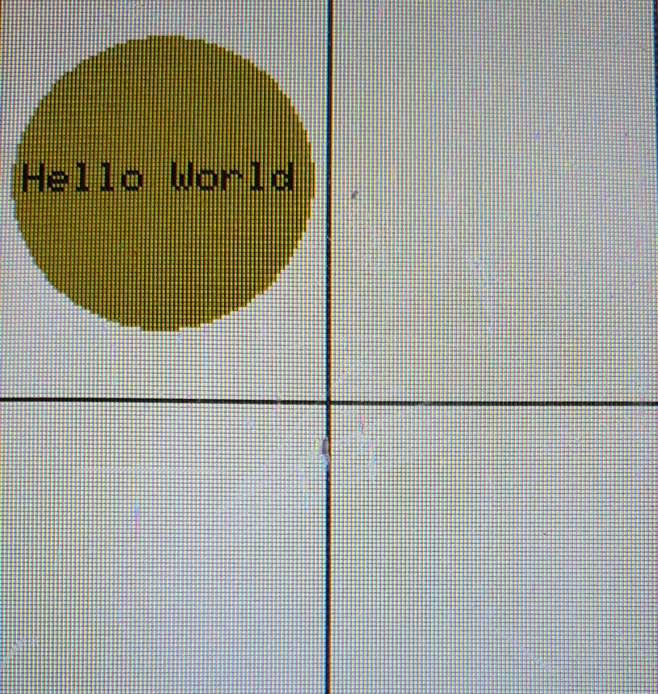
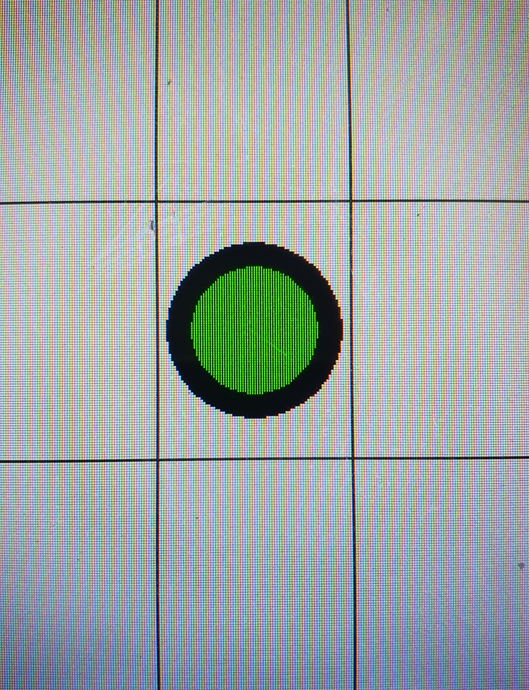

.. _roundbutton:

Button_Round
++++++++++++++

Beschreibung
=============
``Button_Round`` Objekte sind :ref:`Buttons <button>` mit einer runden Form. Sie unterscheiden sich von anderen Buttons jediglich hinsichtlich ihres Aussehens.
 

Beispielbilder
=====================

Diese Bilder dienen nur der Veranschaulichung, wie Objekte dieser Klasse aussehen können.

.. code-block:: 

    new Button_Round("Hello World", COLOR_DARK_YELLOW, 1, TML_empty_button)

.. code-block:: 

    new Button_Round("", COLOR_GREEN, 50, TML_empty_button)

Funktionen
=============

.. csv-table:: 
    :widths: 100 10000

    , ":ref:`RoundButton <roundButtonConstructorButtonitemonoff>` (const char* itemOn, const char* itemOff, const Color& color, const uint8_t borderSize, const std::function<void()> button_callback, ExternalButtonValue* const value=nullptr)"
    , ":ref:`RoundButton <roundbuttonconstructorbuttonitem>` (const char* item, const Color& color, const uint8_t borderSize, const std::function<void()> button_callback, ExternalButtonValue* const value=nullptr)"
    , ":ref:`RoundButton <roundButtonConstructorButtonitemonofflongpress>` (const char* itemOn, const char* itemOff, const Color& color, const uint8_t borderSize, const std::function<void()> button_callback, const std::function<void()> longpress_callback, ExternalButtonValue* const value=nullptr)"
    , ":ref:`RoundButton <roundbuttonconstructorbuttonitemlongpress>` (const char* item, const Color& color, const uint8_t borderSize, const std::function<void()> button_callback, const std::function<void()> longpress_callback, ExternalButtonValue* const value=nullptr)"
    , ":ref:`RoundButton <roundButtonConstructorswitchitemonoff>` (const char* itemOn, const char* itemOff, const Color& color, const uint8_t borderSize, const std::function<void(bool)> switch_callback, ExternalButtonValue* const value=nullptr)"
    , ":ref:`RoundButton <roundButtonConstructorswitchitem>` (const char* item, const Color& color, const uint8_t borderSize, const std::function<void(bool)> switch_callback, ExternalButtonValue* const value=nullptr)"
    , ":ref:`RoundButton <roundButtonConstructorswitchitemonofflongpress>` (const char* itemOn, const char* itemOff, const Color& color, const uint8_t borderSize, const std::function<void(bool)> switch_callback, const std::function<void()> longpress_callback, ExternalButtonValue* const value=nullptr)"
    , ":ref:`RoundButton <roundButtonConstructorswitchitemlongpress>` (const char* item, const Color& color, const uint8_t borderSize, const std::function<void(bool)> switch_callback, const std::function<void()> longpress_callback, ExternalButtonValue* const value=nullptr)"
    , ":ref:`~RoundButton <roundButtondestructor>` ()"
    void, ":ref:`draw <roundbuttondraw>` () override"
    void, ":ref:`setTouch <roundbuttonsettouch>` (Inputs& input) override"
    uint16_t , ":ref:`getHeight <roundbuttongetheight>` ()"
    uint16_t , ":ref:`getWidth <roundbuttongetwidth>` ()"
    uint16_t , ":ref:`getMidX <roundbuttongetMidX>` ()"
    uint16_t , ":ref:`getMidY <roundbuttongetMidY>` ()"
    bool , ":ref:`checkSize <roundbuttonchecksize>` (uint16_t sizeX, uint16_t sizeY, uint8_t rotation) override"

Variablen und Konstanten
==========================

.. csv-table:: 
    :widths: 100 10000

    const Color, ":ref:`color <roundButtonvcolor>`"
    ":ref:`Item* <item>`", ":ref:`itemOn <roundButtonvitemon>`"
    ":ref:`Item* <item>`", ":ref:`itemOff <roundButtonvitemoff>`"
    const, ":ref:`d<roundButtonvd>`"
    

Funktionen Beschreibung
=========================

.. _roundButtonconstructorbuttonitemonoff:

Button_Round(const char* itemOn, const char* itemOff, const Color& color, const uint8_t borderSize, const std::function<void()> button_callback, ExternalButtonValue* const value=nullptr)
~~~~~~~~~~~~~~~~~~~~~~~~~~~~~~~~~~~~~~~~~~~~~~~~~~~~~~~~~~~~~~~~~~~~~~~~~~~~~~~~~~~~~~~~~~~~~~~~~~~~~~~~~~~~~~~~~~~~~~~~~~~~~~~~~~~~~~~~~~~~~~~~~~~~~~~~~~~~~~~~~~~~~~~~~~~~~~~~~~~~~~~~~~~~

.. literalinclude:: ../../src/ElementViews/Button_Round.cpp
    :lines: 5-11
    :linenos:

Diese Funktion ist ein Konstruktor, der einen runden Button (keinen Switch) erzeugt. Als Parameter nimmt der Konstruktor einen String für ein Erzeugung eines :ref:`Item<item>`
für die aktivierte (``itemOn``) und deaktivierte (``itemOff``) Form des Buttons, eine Farbe (``color``), die Breite der Umrandung (``borderSize``),
eine Button Callback Funktion (``button_callback``) (siehe :ref:`button_callback<buttonbuttoncallback>`), 
sowie dem ``value``, der angibt, ob der Button aktiviert ist oder nicht.

In der Initialisierungsliste wird zum einen dieser :ref:`Button Konstruktor<buttonbutton>` aufgerufen, zum anderen erfolgt die Initialisierung von :ref:`color<roundbuttonvcolor>` und  
:ref:`borderSize<roundbuttonvbordersize>` mit den korrespondierenden Parametern. 
Für die Initialisierung von :ref:`itemOn<roundbuttonvitemon>` erfolgt ein Funktionsaufruf von :ref:`createItem<displaycreateitemnocolor>` mit ``itemOn`` und 
:ref:`color.getItemColor()<colorgetitemcolor>` und für :ref:`itemOff<roundbuttonvitemoff>` erfolgt ebenfalls 
ein Funktionsaufruf von :ref:`createItem<displaycreateitemnocolor>`, aber diesmal mit ``ItemOff`` und :ref:`color.getItemColor()<colorgetsecondaryitemcolor>`.

.. _roundButtonconstructorbuttonitem:

Button_Round(const char* item, const Color& color, const uint8_t borderSize, const std::function<void()> button_callback, ExternalButtonValue* const value=nullptr)
~~~~~~~~~~~~~~~~~~~~~~~~~~~~~~~~~~~~~~~~~~~~~~~~~~~~~~~~~~~~~~~~~~~~~~~~~~~~~~~~~~~~~~~~~~~~~~~~~~~~~~~~~~~~~~~~~~~~~~~~~~~~~~~~~~~~~~~~~~~~~~~~~~~~~~~~~~~~~~~~~~~~~~~~~~~~~~~~~~~~~~~~~~~~~~~~~~~~~~~~~

.. literalinclude:: ../../src/ElementViews/Button_Round.cpp
    :lines: 13-19
    :linenos:

Diese Funktion ist ein Konstruktor, der einen runden Button (keinen Switch) erzeugt. Als Parameter nimmt der Konstruktor einen String für ein Erzeugung eines :ref:`Items<item>`, 
welche für sowohl die aktivierte und deaktivierte Form des Buttons verwendet wird (``item``), eine Farbe (``color``), die Breite der Umrandung (``borderSize``),
eine Button Callback Funktion (``button_callback``) (siehe :ref:`button_callback<buttonbuttoncallback>`), 
sowie dem ``value``, der angibt, ob der Button aktiviert ist oder nicht.

In der Initialisierungsliste wird zum einen dieser :ref:`Button Konstruktor<buttonbutton>` aufgerufen, zum anderen erfolgt die Initialisierung von :ref:`color<roundbuttonvcolor>` und  
:ref:`borderSize<roundbuttonvbordersize>` mit den korrespondierenden Parametern. 
Für die Initialisierung von :ref:`itemOn<roundbuttonvitemon>` erfolgt ein Funktionsaufruf von :ref:`createItem<displaycreateitemnocolor>` mit ``item`` und 
:ref:`color.getItemColor()<colorgetitemcolor>` und für :ref:`itemOff<roundbuttonvitemoff>` erfolgt ebenfalls 
ein Funktionsaufruf von :ref:`createItem<displaycreateitemnocolor>`, aber diesmal mit ``item`` und :ref:`color.getItemColor()<colorgetsecondaryitemcolor>`.

.. _roundButtonconstructorbuttonitemonofflongpress:

Button_Round(const char* itemOn, const char* itemOff, const Color& color, const uint8_t borderSize, const std::function<void()> button_callback, const std::function<void()> longpress_callback, ExternalButtonValue* const value=nullptr)
~~~~~~~~~~~~~~~~~~~~~~~~~~~~~~~~~~~~~~~~~~~~~~~~~~~~~~~~~~~~~~~~~~~~~~~~~~~~~~~~~~~~~~~~~~~~~~~~~~~~~~~~~~~~~~~~~~~~~~~~~~~~~~~~~~~~~~~~~~~~~~~~~~~~~~~~~~~~~~~~~~~~~~~~~~~~~~~~~~~~~~~~~~~~~~~~~~~~~~~~~~~~~~~~~~~~~~~~~~~~~~~~~~~~~~~~~~~~~~~~~~~~~~~~~~~~~~~~

.. literalinclude:: ../../src/ElementViews/Button_Round.cpp
    :lines: 21-27
    :linenos:

Diese Funktion ist ein Konstruktor, der einen runden Button (keinen Switch) erzeugt. Als Parameter nimmt der Konstruktor einen String für ein Erzeugung eines :ref:`Item<item>`
für die aktivierte (``itemOn``) und deaktivierte (``itemOff``) Form des Buttons, eine Farbe (``color``), die Breite der Umrandung (``borderSize``),
eine Button Callback Funktion (``button_callback``) (siehe :ref:`button_callback<buttonbuttoncallback>`), 
eine Longpress Callback Funktion (``longpress_callback``) (siehe :ref:`longpress_callback<buttonlongpresscallback>`), 
sowie dem ``value``, der angibt, ob der Button aktiviert ist oder nicht.

In der Initialisierungsliste wird zum einen dieser :ref:`Button Konstruktor<buttonbuttonlongpress>` aufgerufen, zum anderen erfolgt die Initialisierung von :ref:`color<roundbuttonvcolor>` und  
:ref:`borderSize<roundbuttonvbordersize>` mit den korrespondierenden Parametern. 
Für die Initialisierung von :ref:`itemOn<roundbuttonvitemon>` erfolgt ein Funktionsaufruf von :ref:`createItem<displaycreateitemnocolor>` mit ``itemOn`` und 
:ref:`color.getItemColor()<colorgetitemcolor>` und für :ref:`itemOff<roundbuttonvitemoff>` erfolgt ebenfalls 
ein Funktionsaufruf von :ref:`createItem<displaycreateitemnocolor>`, aber diesmal mit ``ItemOff`` und :ref:`color.getItemColor()<colorgetsecondaryitemcolor>`.

.. _roundButtonconstructorbuttonitemlongpress:

Button_Round(const char* item, const Color& color, const uint8_t borderSize, const std::function<void()> button_callback, const std::function<void()> longpress_callback, ExternalButtonValue* const value=nullptr);
~~~~~~~~~~~~~~~~~~~~~~~~~~~~~~~~~~~~~~~~~~~~~~~~~~~~~~~~~~~~~~~~~~~~~~~~~~~~~~~~~~~~~~~~~~~~~~~~~~~~~~~~~~~~~~~~~~~~~~~~~~~~~~~~~~~~~~~~~~~~~~~~~~~~~~~~~~~~~~~~~~~~~~~~~~~~~~~~~~~~~~~~~~~~~~~~~~~~~~~~~~~~~~~~~~~~~~~~~~~~~~~~~~~~~~~~~~~~~~~~~~~~~~~~~~~~~~~~

.. literalinclude:: ../../src/ElementViews/Button_Round.cpp
    :lines: 29-35
    :linenos:

Diese Funktion ist ein Konstruktor, der einen runden Button (keinen Switch) erzeugt. Als Parameter nimmt der Konstruktor einen String für ein Erzeugung eines :ref:`Items<item>`, 
welche für sowohl die aktivierte und deaktivierte Form des Buttons verwendet wird (``item``), eine Farbe (``color``), die Breite der Umrandung (``borderSize``),
den gewünschten Krümmungsradius der Ecken (``borderRadius``), eine Button Callback Funktion (``button_callback``) (siehe :ref:`button_callback<buttonbuttoncallback>`), 
eine Longpress Callback Funktion (``longpress_callback``) (siehe :ref:`longpress_callback<buttonlongpresscallback>`), 
sowie dem ``value``, der angibt, ob der Button aktiviert ist oder nicht.

In der Initialisierungsliste wird zum einen dieser :ref:`Button Konstruktor<buttonbuttonlongpress>` aufgerufen, zum anderen erfolgt die Initialisierung von :ref:`color<roundbuttonvcolor>` und  
:ref:`borderSize<roundbuttonvbordersize>` mit den korrespondierenden Parametern. 
Für die Initialisierung von :ref:`itemOn<roundbuttonvitemon>` erfolgt ein Funktionsaufruf von :ref:`createItem<displaycreateitemnocolor>` mit ``item`` und 
:ref:`color.getItemColor()<colorgetitemcolor>` und für :ref:`itemOff<roundbuttonvitemoff>` erfolgt ebenfalls 
ein Funktionsaufruf von :ref:`createItem<displaycreateitemnocolor>`, aber diesmal mit ``Item`` und :ref:`color.getItemColor()<colorgetsecondaryitemcolor>`.

.. _roundButtonconstructorswitchitemonoff:

Button_Round(const char* itemOn, const char* itemOff, const Color& color, const uint8_t borderSize, const std::function<void(bool)> switch_callback, ExternalButtonValue* const value=nullptr);
~~~~~~~~~~~~~~~~~~~~~~~~~~~~~~~~~~~~~~~~~~~~~~~~~~~~~~~~~~~~~~~~~~~~~~~~~~~~~~~~~~~~~~~~~~~~~~~~~~~~~~~~~~~~~~~~~~~~~~~~~~~~~~~~~~~~~~~~~~~~~~~~~~~~~~~~~~~~~~~~~~~~~~~~~~~~~~~~~~~~~~~~~~~~~~~~~~~~~~~~~

.. literalinclude:: ../../src/ElementViews/Button_Round.cpp
    :lines: 37-43
    :linenos:

Diese Funktion ist ein Konstruktor, der einen runden Switch (keinen Button) erzeugt. Als Parameter nimmt der Konstruktor einen String für ein Erzeugung eines :ref:`Item<item>`
für die aktivierte (``itemOn``) und deaktivierte (``itemOff``) Form des Switches, eine Farbe (``color``), die Breite der Umrandung (``borderSize``),
den gewünschten Krümmungsradius der Ecken (``borderRadius``), eine Switch Callback Funktion (``switch_callback``) (siehe :ref:`switch_callback<buttonswitchcallback>`), 
sowie dem ``value``, der angibt, ob der Switch aktiviert ist oder nicht.

In der Initialisierungsliste wird zum einen dieser :ref:`Button Konstruktor<buttonswitch>` aufgerufen, zum anderen erfolgt die Initialisierung von :ref:`color<roundbuttonvcolor>` und  
:ref:`borderSize<roundbuttonvbordersize>` mit den korrespondierenden Parametern. 
Für die Initialisierung von :ref:`itemOn<roundbuttonvitemon>` erfolgt ein Funktionsaufruf von :ref:`createItem<displaycreateitemnocolor>` mit ``itemOn`` und 
:ref:`color.getItemColor()<colorgetitemcolor>` und für :ref:`itemOff<roundbuttonvitemoff>` erfolgt ebenfalls 
ein Funktionsaufruf von :ref:`createItem<displaycreateitemnocolor>`, aber diesmal mit ``ItemOff`` und :ref:`color.getItemColor()<colorgetsecondaryitemcolor>`.

.. _roundButtonconstructorswitchitem:

Button_Round(const char* item, const Color& color, const uint8_t borderSize, const std::function<void(bool)> switch_callback, ExternalButtonValue* const value=nullptr);
~~~~~~~~~~~~~~~~~~~~~~~~~~~~~~~~~~~~~~~~~~~~~~~~~~~~~~~~~~~~~~~~~~~~~~~~~~~~~~~~~~~~~~~~~~~~~~~~~~~~~~~~~~~~~~~~~~~~~~~~~~~~~~~~~~~~~~~~~~~~~~~~~~~~~~~~~~~~~~~~~~~~~~~~~~~~~~~~~~~~~~~~~~~~~~~~~~~~~~~~~

.. literalinclude:: ../../src/ElementViews/Button_Round.cpp
    :lines: 45-51
    :linenos:

Diese Funktion ist ein Konstruktor, der einen runden Switch (keinen Button) erzeugt. Als Parameter nimmt der Konstruktor einen String für ein Erzeugung eines :ref:`Items<item>`, 
welche für sowohl die aktivierte und deaktivierte Form des Switches verwendet wird (``item``), eine Farbe (``color``), die Breite der Umrandung (``borderSize``),
den gewünschten Krümmungsradius der Ecken (``borderRadius``), eine Switch Callback Funktion (``switch_callback``) (siehe :ref:`switch_callback<buttonswitchcallback>`), 
sowie dem ``value``, der angibt, ob der Switch aktiviert ist oder nicht.

In der Initialisierungsliste wird zum einen dieser :ref:`Button Konstruktor<buttonswitch>` aufgerufen, zum anderen erfolgt die Initialisierung von :ref:`color<roundbuttonvcolor>` und  
:ref:`borderSize<roundbuttonvbordersize>` mit den korrespondierenden Parametern. 
Für die Initialisierung von :ref:`itemOn<roundbuttonvitemon>` erfolgt ein Funktionsaufruf von :ref:`createItem<displaycreateitemnocolor>` mit ``item`` und 
:ref:`color.getItemColor()<colorgetitemcolor>` und für :ref:`itemOff<roundbuttonvitemoff>` erfolgt ebenfalls 
ein Funktionsaufruf von :ref:`createItem<displaycreateitemnocolor>`, aber diesmal mit ``Item`` und :ref:`color.getItemColor()<colorgetsecondaryitemcolor>`.

.. _roundButtonconstructorswitchitemonofflongpress:

Button_Round(const char* itemOn, const char* itemOff, const Color& color, const uint8_t borderSize, const std::function<void(bool)> switch_callback, const std::function<void()> longpress_callback, ExternalButtonValue* const value=nullptr);
~~~~~~~~~~~~~~~~~~~~~~~~~~~~~~~~~~~~~~~~~~~~~~~~~~~~~~~~~~~~~~~~~~~~~~~~~~~~~~~~~~~~~~~~~~~~~~~~~~~~~~~~~~~~~~~~~~~~~~~~~~~~~~~~~~~~~~~~~~~~~~~~~~~~~~~~~~~~~~~~~~~~~~~~~~~~~~~~~~~~~~~~~~~~~~~~~~~~~~~~~~~~~~~~~~~~~~~~~~~~~~~~~~~~~~~~~~~~~~~~~~~~~~~~~~~~~~~~

.. literalinclude:: ../../src/ElementViews/Button_Round.cpp
    :lines: 53-59
    :linenos:

Diese Funktion ist ein Konstruktor, der einen runden Switch (keinen Button) erzeugt. Als Parameter nimmt der Konstruktor einen String für ein Erzeugung eines :ref:`Item<item>`
für die aktivierte (``itemOn``) und deaktivierte (``itemOff``) Form des Switches, eine Farbe (``color``), die Breite der Umrandung (``borderSize``),
den gewünschten Krümmungsradius der Ecken (``borderRadius``), eine Switch Callback Funktion (``switch_callback``) (siehe :ref:`switch_callback<buttonswitchcallback>`), 
eine Longpress Callback Funktion (``longpress_callback``) (siehe :ref:`longpress_callback<buttonlongpresscallback>`), sowie dem ``value``, der angibt, ob der Button aktiviert ist oder nicht.

In der Initialisierungsliste wird zum einen dieser :ref:`Button Konstruktor<buttonswitchlongpress>` aufgerufen, zum anderen erfolgt die Initialisierung von :ref:`color<roundbuttonvcolor>` und   
:ref:`borderSize<roundbuttonvbordersize>` mit den korrespondierenden Parametern. 
Für die Initialisierung von :ref:`itemOn<roundbuttonvitemon>` erfolgt ein Funktionsaufruf von :ref:`createItem<displaycreateitemnocolor>` mit ``itemOn`` und 
:ref:`color.getItemColor()<colorgetitemcolor>` und für :ref:`itemOff<roundbuttonvitemoff>` erfolgt ebenfalls 
ein Funktionsaufruf von :ref:`createItem<displaycreateitemnocolor>`, aber diesmal mit ``ItemOff`` und :ref:`color.getItemColor()<colorgetsecondaryitemcolor>`.

.. _roundButtonconstructorswitchitemlongpress:

Button_Round(const char* item, const Color& color, const uint8_t borderSize, const std::function<void(bool)> switch_callback, const std::function<void()> longpress_callback, ExternalButtonValue* const value=nullptr);
~~~~~~~~~~~~~~~~~~~~~~~~~~~~~~~~~~~~~~~~~~~~~~~~~~~~~~~~~~~~~~~~~~~~~~~~~~~~~~~~~~~~~~~~~~~~~~~~~~~~~~~~~~~~~~~~~~~~~~~~~~~~~~~~~~~~~~~~~~~~~~~~~~~~~~~~~~~~~~~~~~~~~~~~~~~~~~~~~~~~~~~~~~~~~~~~~~~~~~~~~~~~~~~~~~~~~~~~~~~~~~~~~~~~~~~~~~~~~~~~~~~~~~~~~~~~~~~~

.. literalinclude:: ../../src/ElementViews/Button_Round.cpp
    :lines: 61-67
    :linenos:

Diese Funktion ist ein Konstruktor, der einen runden Switch (keinen Button) erzeugt. Als Parameter nimmt der Konstruktor einen String für ein Erzeugung eines :ref:`Items<item>`, 
welche für sowohl die aktivierte und deaktivierte Form des Switches verwendet wird (``item``), eine Farbe (``color``), die Breite der Umrandung (``borderSize``),
den gewünschten Krümmungsradius der Ecken (``borderRadius``), eine Switch Callback Funktion (``switch_callback``) (siehe :ref:`switch_callback<buttonswitchcallback>`), 
eine Longpress Callback Funktion (``longpress_callback``) (siehe :ref:`longpress_callback<buttonlongpresscallback>`), 
sowie dem ``value``, der angibt, ob der Switch aktiviert ist oder nicht.

In der Initialisierungsliste wird zum einen dieser :ref:`Button Konstruktor<buttonswitchlongpress>` aufgerufen, zum anderen erfolgt die Initialisierung von :ref:`color<roundbuttonvcolor>` und   
:ref:`borderSize<roundbuttonvbordersize>` mit den korrespondierenden Parametern. 
Für die Initialisierung von :ref:`itemOn<roundbuttonvitemon>` erfolgt ein Funktionsaufruf von :ref:`createItem<displaycreateitemnocolor>` mit ``item`` und 
:ref:`color.getItemColor()<colorgetitemcolor>` und für :ref:`itemOff<roundbuttonvitemoff>` erfolgt ebenfalls 
ein Funktionsaufruf von :ref:`createItem<displaycreateitemnocolor>`, aber diesmal mit ``Item`` und :ref:`color.getItemColor()<colorgetsecondaryitemcolor>`.

.. _roundButtonDestructor:

~RoundButton ()
~~~~~~~~~~~~~~~~~~~~~~~~
.. literalinclude:: ../../src/ElementViews/Button_Round.cpp
    :lines: 70-73
    :linenos:

Der Destruktor wird bei der Zerstörung eines ``RoundButton`` Objektes aufgerufen. Mit ``delete`` wird der von Speicherplatz von ":ref:`itemOn<roundbuttonvitemon>`" und ":ref:`itemOff<roundbuttonvitemoff>`" wieder freigegeben.

.. _roundButtondraw:

void draw () override
~~~~~~~~~~~~~~~~~~~~~~~~~~~~~~~~~~~~~~~~~~~~~~
.. literalinclude:: ../../src/ElementViews/Button_Round.cpp
    :lines: 95-109
    :linenos:

Diese Funktion ist verantwortlich für das Zeichnen des ``RoundButton`` Objektes.   

.. literalinclude:: ../../src/ElementViews/Button_Round.cpp
    :lines: 98-101

Sollte ``value==true`` gelten, also sollte der Button aktiviert sein, wird
die :ref:`circle <displaytftespicircleinfill>` Funktion des :ref:`display <elementvdisplay>` aufgerufen, um einen Kreis zu zeichen. 
Die Parameter ``posX + sizeX/2`` und ``posY + sizeY/2`` lassen das Objekt an der gewünschten stelle erscheinen, für die Umrandungsfarbe rufen wir 
die :ref:`getBorderColor <colorgetbordercolor>` Funktion von :ref:`color <roundbuttonvcolor>` und als die Füllfarbe des Buttons verwenden wir :ref:`color <roundbuttonvcolor>`.
Falls ``itemOn==true`` gelten sollte, zeichnen wir dieses Item direkt. Dazu rufen wir die ":ref:`drawItem <displayDrawItemColor>`" Funktion auf und übergeben als Parameter u.a. besagtes 
Item (:ref:`itemOn <roundbuttonvitemon>`) sowie die Farbe des Items, welche mit :ref:`getItemColor <colorgetitemcolor>` erhalten wird.

.. literalinclude:: ../../src/ElementViews/Button_Round.cpp
    :lines: 103-107

Sollte ``value==false`` gelten, also sollte der Button deaktiviert sein, wird ebenso 
die :ref:`circle <displaytftespicircleinfill>` Funktion des :ref:`display <elementvdisplay>` aufgerufen, um einen Kreis zu zeichen.
Nur diesmal übergeben wir das Ergebnis der Funktionsaufrufe von :ref:`getSecondaryBorderColor <colorgetsecondarybordercolor>` und :ref:`getSecondaryColor <colorgetsecondarycolor>` 
für die Umrandungs- bzw- Füllfarbe. Außerdem wird geprüft, ob ``itemOff==true`` gelten sollte. 
Falls dies der Fall ist, wird :ref:`itemOff <roundbuttonvitemon>` gezeichnet. 
Die Vorgehensweise ist die selbe wie weiter oben, nur übergeben wir diesmal das :ref:`itemOff <roundbuttonvitemon>` und übergeben die 
Farbe, die nach dem Funktionsaufruf von :ref:`getSecondaryBorderColor <colorgetsecondarybordercolor>` bestimmt wird.

.. _roundButtonGetHeight:

uint16_t getHeight()
~~~~~~~~~~~~~~~~~~~~~~
.. literalinclude:: ../../src/ElementViews/Button_Round.cpp
    :lines: 111-113
    :linenos:

Diese Funktion gibt die Höhe (also die Größe in X-Richtung) des Objektes zurück.

.. _roundButtonGetWidth:

uint16_t getWidth()
~~~~~~~~~~~~~~~~~~~~~~
.. literalinclude:: ../../src/ElementViews/Button_Round.cpp
    :lines: 115-117
    :linenos:

Diese Funktion gibt die Breite (also die Größe in Y-Richtung) des Objektes zurück.

.. _roundButtonGetMidX:

uint16_t getMidX() 
~~~~~~~~~~~~~~~~~~~~~~
.. literalinclude:: ../../src/ElementViews/Button_Round.h
    :lines: 27
    :linenos:

Diese Funktion gibt den Mittelpunkt der X-Ausprägung des Objektes zurück.

.. _roundButtonGetMidY:

uint16_t getMidY()
~~~~~~~~~~~~~~~~~~~~~~
.. literalinclude:: ../../src/ElementViews/Button_Round.h
    :lines: 28
    :linenos:

Diese Funktion gibt den Mittelpunkt der Y-Ausprägung des Objektes zurück.

.. _roundButtonsettouch:

void setTouch(Inputs& input) override
~~~~~~~~~~~~~~~~~~~~~~~~~~~~~~~~~~~~~~~~~~~~
.. literalinclude:: ../../src/ElementViews/Button_Round.cpp
    :lines: 85-93
    :linenos:

Mit dieser Funktion wird bestimmt, ob das Objekt berührt wird oder nicht.

.. literalinclude:: ../../src/ElementViews/Button_Round.cpp
    :lines: 86

Zuerst wird der Durchmesser des Kreises bestimmt, indem das Minimum aus :ref:`sizeX<elementvsizex>` und :ref:`sizeY<elementvsizey>`
gewählt wird. So wird sichergestellt, dass wir uns innerhalb der Kreisform befinden.

.. literalinclude:: ../../src/ElementViews/Button_Round.cpp
    :lines: 87-90

Anschließend werden zwei Punkte berechnet. Das Koordinatenpaar ``xr`` und ``yr`` entspricht dem Punkt in der Mitte des Kreises, ``x1`` und ``y1`` ist ein beliebiger Punkt auf dem Rand des Kreises.

.. literalinclude:: ../../src/ElementViews/Button_Round.cpp
    :lines: 91

Nun wird getestet, ob die Toucheingabe innerhalb dieses Bereiches stattfindet, indem die berechneten Punkte mit 
:ref:`input.touchX<inputvtouchx>` und :ref:`input.touchY<inputvtouchY>` verglichen werden.
Wenn das zutrifft, wird :ref:`setTouch<buttonsettouch>` der :ref:`Button<button>` Klasse aufgerufen. 

.. _roundButtonchecksize:

bool checkSize (uint16_t sizeX, uint16_t sizeY, uint8_t rotation) override;
~~~~~~~~~~~~~~~~~~~~~~~~~~~~~~~~~~~~~~~~~~~~~~~~~~~~~~~~~~~~~~~~~~~~~~~~~~~~~~~~~~~~~~~~~~~~
.. literalinclude:: ../../src/ElementViews/Button_Round.cpp
    :lines: 75-83
    :linenos:

Diese Funktion überprüft, ob Objekte der ``Button_Round`` Klasse zeichenbar sind, oder zu klein sind, um sie anzuzeigen. Außerdem legt 
sie Auflösung bzw. Größe von :ref:`itemOn<roundbuttonvitemon>` und :ref:`itemOff<roundbuttonvitemoff>` auf dem Objekt fest.
Die Parameter der Funktion sind die Höhe (``sizeY``) und Breite des Objektes (``sizeX``).

.. literalinclude:: ../../src/ElementViews/Button_Round.cpp
    :lines: 77

Zuerst wird der Durchmesser des Kreises bestimmt, indem das Minimum aus :ref:`sizeX<elementvsizex>` und :ref:`sizeY<elementvsizey>`
gewählt wird. Dieses wird mit dem Skalierungsfaktor :ref:`scale<roundbuttonvscale>` multipliziert, um die gewünschte Größe zu erhalten. 

.. literalinclude:: ../../src/ElementViews/Button_Round.cpp
    :lines: 78

Nun wird die Variable ``tmp`` erstellt, die den Durchmesser des Kreisinhalts (also ohne Umrandung) speichert.

.. literalinclude:: ../../src/ElementViews/Button_Round.cpp
    :lines: 79-80

Basierend auf ``tmp`` wird nun für :ref:`itemOn<roundbuttonvitemon>` und :ref:`itemOff<roundbuttonvitemoff>` mit :ref:`setResolution<itemsetresolution>`
die Auflösung bzw. Größe berechnet.

.. literalinclude:: ../../src/ElementViews/Button_Round.cpp
    :lines: 82

Sollte jedoch ``sizeX > 30 && sizeY > 30`` nicht gelten, so ist das Objekt nicht groß genug, um es auf dem Display anzuzeigen. Die Funktion gibt ``false`` zurück.

Variablen und Konstanten Beschreibung
=====================================

.. _roundButtonvcolor:

const Color color
~~~~~~~~~~~~~~~~~~~~~~~~~~~

Die Farbe (:ref:`Color<color>`) des Objektes.

.. _roundButtonvbordersize:

const uint8_t borderSize
~~~~~~~~~~~~~~~~~~~~~~~~~~

Gibt an, wie dick die Umrandung ist.

.. _roundButtonvitemon:

Item* itemOn = nullptr
~~~~~~~~~~~~~~~~~~~~~~~~~~~

Das Item (:ref:`Item<item>`), das auf dem Objekt im angeschalteten Zustand angezeigt wird.

.. _roundButtonvitemoff:

Item* itemOff = nullptr
~~~~~~~~~~~~~~~~~~~~~~~~~~~

Das Item (:ref:`Item<item>`), das auf dem Objekt im ausgeschalteten Zustand angezeigt wird.

.. _roundButtonvd:

const uint16_t d
~~~~~~~~~~~~~~~~~~~~~~~~~~~

Gibt den Durchmesser des Kreises (also der Grundform des Objeketes) an.

.. _roundButtonvscale:

const double scale = 0.9
~~~~~~~~~~~~~~~~~~~~~~~~~~

Der Skalierungsfaktor, der die Größe des Kreises beeinflusst.