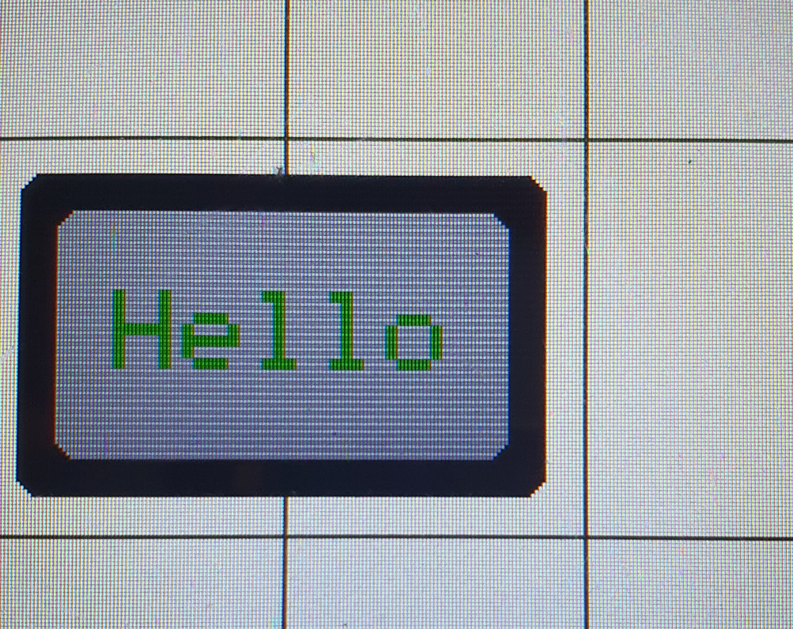

.. _textbox_rect:

Textbox_Rect
++++++++++++++

Beschreibung
=============

Diese Klasse erzeugt rechteckige Umrandungen/ Kästen für :ref:`Elemente<element>`.

Tutorials/ Examples
=====================
Diese Bild dient nur der Veranschaulichung, wie Objekte dieser Klasse aussehen können.

.. code-block:: 

    new Textbox_Rect("Hello", 3, COLOR_GRAY|COLOR_DARK_GREEN)

Funktionen
=============

.. csv-table:: 
    :widths: 100 10000

    inline, ":ref:`Textbox_Rect <textbox_rectconstructoritemstr>` (char* itemStr, const Color& color, ExternalTextboxValue* value=nullptr)"
    inline, ":ref:`Textbox_Rect <textbox_rectconstructoritem>` (Item* item, const Color& color, ExternalTextboxValue* value=nullptr)"
    inline, ":ref:`Textbox_Rect <textbox_rectconstructoritemstrtextsize>` (const char* itemStr, const uint8_t textsize, const Color& color, ExternalTextboxValue* value=nullptr)"
    inline, ":ref:`Textbox_Rect <textbox_rectconstructoritemtextsize>` (const char* itemStr, const uint8_t textsize, const Color& color, ExternalTextboxValue* value=nullptr)"
    inline void, ":ref:`draw <textbox_rectdraw>` ()"
    Color, ":ref:`getColor <textbox_rectgetcolor>` ()"

Variablen und Konstanten
==========================

.. csv-table:: 
    :widths: 100 10000

    const ":ref:`Color <Color>`", ":ref:`color <textbox_rectvcolor>`"
    const uint16_t, ":ref:`t <textbox_rectvT>` = 10"
    const uint16_t, ":ref:`b <textbox_rectvB>` = 10"
    const uint16_t, ":ref:`r <textbox_rectvR>` = 6"

Funktionen Beschreibung
=========================

.. _textbox_rectConstructorItemStr:

inline Textbox_Rect(char* itemStr, const Color& color, ExternalTextboxValue* value=nullptr)
~~~~~~~~~~~~~~~~~~~~~~~~~~~~~~~~~~~~~~~~~~~~~~~~~~~~~~~~~~~~~~~~~~~~~~~~~~~~~~~~~~~~~~~~~~~~~~~~~~~~~~~~~~~~~~~~~~~~~~~~~~~~~~~~~~~~~~~~~~~~~
.. literalinclude:: ../../src/ElementViews/textbox_rect.h
    :lines: 10-11
    :linenos:

Diese Funktion ist ein Konstruktor, der Objekte der ``Textbox_Rect`` Klasse erzeugt. Als Parameter nimmt er einen String, welches zu einem :ref:`Item<item>` umgewandelt werden soll (``itemStr``), 
die Farbe der Textbox (``color``) und dem ``value``, der angibt, in welchem Zustand sich das Objekt befindet. 

In der Initialisierungsliste erfolgt zuerst der Aufruf vom :ref:`Textbox<textboxconstructor>` Konstruktor, dessen Argument das Ergebnis des Funktionsaufruf von 
:ref:`createItem<displaycreateitemcolor>` der :ref:`Display<display>` Klasse (``itemStr`` wird zu einem :ref:`Item<item>` umgewandelt) ist.
Außerdem erfolgt die Initialisierung von :ref:`color<textbox_rectvcolor>` dem entsprechenden Parameter.

.. _textbox_rectConstructorItem:

inline Textbox_Rect(char* itemStr, const Color& color, ExternalTextboxValue* value=nullptr)
~~~~~~~~~~~~~~~~~~~~~~~~~~~~~~~~~~~~~~~~~~~~~~~~~~~~~~~~~~~~~~~~~~~~~~~~~~~~~~~~~~~~~~~~~~~~~~~~~~~~~~~~~~~~~~~~~~~~~~~~~~~~~~~~~~~~~~~~~~~~~
.. literalinclude:: ../../src/ElementViews/textbox_rect.h
    :lines: 13-14
    :linenos:

Diese Funktion ist ein Konstruktor, der Objekte der ``Textbox_Rect`` Klasse erzeugt. Als Parameter nimmt er :ref:`Item<item>` (``item``), 
die Farbe der Textbox (``color``) und dem ``value``, der angibt, in welchem Zustand sich das Objekt befindet. 

In der Initialisierungsliste erfolgt zuerst der Aufruf vom :ref:`Textbox<textboxconstructor>` Konstruktor, dann die Initialisierung von :ref:`color<textbox_rectvcolor>` dem entsprechenden Parameter.

.. _textbox_rectConstructorItemstrtextsize:

inline Textbox_Rect(const char* itemStr, const uint8_t textsize, const Color& color, ExternalTextboxValue* value=nullptr)
~~~~~~~~~~~~~~~~~~~~~~~~~~~~~~~~~~~~~~~~~~~~~~~~~~~~~~~~~~~~~~~~~~~~~~~~~~~~~~~~~~~~~~~~~~~~~~~~~~~~~~~~~~~~~~~~~~~~~~~~~~~
.. literalinclude:: ../../src/ElementViews/textbox_rect.h
    :lines: 16-17
    :linenos:

Diese Funktion ist ein Konstruktor, der Objekte der ``Textbox_Rect`` Klasse erzeugt. Als Parameter nimmt er einen String, welches zu einem :ref:`Item<item>` umgewandelt werden soll (``itemStr``), der Schriftgröße 
(``textSize``), die Farbe der Textbox (``color``) und dem ``value``, der angibt, in welchem Zustand sich das Objekt befindet. 

In der Initialisierungsliste erfolgt zuerst der Aufruf vom :ref:`Textbox<textboxconstructortextsize>` Konstruktor, dessen Argument das Ergebnis des Funktionsaufruf von 
:ref:`createItem<displaycreateitemcolor>` der :ref:`Display<display>` Klasse (``itemStr`` wird zu einem :ref:`Item<item>` umgewandelt) ist.
Außerdem erfolgt die Initialisierung von :ref:`color<textbox_rectvcolor>` dem entsprechenden Parameter.

.. _textbox_rectConstructorItemtextsize:

inline Textbox_Rect(Item* item, const uint8_t textsize, const Color& color, ExternalTextboxValue* value=nullptr)
~~~~~~~~~~~~~~~~~~~~~~~~~~~~~~~~~~~~~~~~~~~~~~~~~~~~~~~~~~~~~~~~~~~~~~~~~~~~~~~~~~~~~~~~~~~~~~~~~~~~~~~~~~~~~~~~~~~~~~~~~~~
.. literalinclude:: ../../src/ElementViews/textbox_rect.h
    :lines: 19-20
    :linenos:

Diese Funktion ist ein Konstruktor, der Objekte der ``Textbox_Rect`` Klasse erzeugt. Als Parameter nimmt er :ref:`Item<item>` (``item``), der Schriftgröße 
(``textSize``), die Farbe der Textbox (``color``) und dem ``value``, der angibt, in welchem Zustand sich das Objekt befindet. 

In der Initialisierungsliste erfolgt zuerst der Aufruf vom :ref:`Textbox<textboxconstructortextsize>` Konstruktor, 
dann die Initialisierung von :ref:`color<textbox_rectvcolor>` dem entsprechenden Parameter.

.. _textbox_rectDraw:

inline void draw()
~~~~~~~~~~~~~~~~~~~
.. literalinclude:: ../../src/ElementViews/textbox_rect.h
    :lines: 22-26
    :linenos:

Diese Funktion wird genutzt, um das Objekt zu zeichnen. 

.. literalinclude:: ../../src/ElementViews/textbox_rect.h
    :lines: 23

Zuerst wird mit dem Funktionsaufruf von :ref:`rect_center<displayrectcenterinfill>` auf dem :ref:`display<elementvdisplay>` das Rechteck gezeichnet,
auf dem das :ref:`item<textboxvitem>` dargestellt werden soll.

.. literalinclude:: ../../src/ElementViews/textbox_rect.h
    :lines: 24

Sollte ein :ref:`externalValue<externaltextboxvalue>` existieren und sollte dieses ein :ref:`value<externaltextboxvaluevvalue>` haben, 
wird dieses mit :ref:`draw<externaltextboxvaluedraw>` gezeichnet.

.. literalinclude:: ../../src/ElementViews/textbox_rect.h
    :lines: 25

Sollte diese Bedingung aber nicht erfüllt werden, wird stattdessen :ref:`item<textboxvitem>` mit :ref:`item<displaydrawitemnocolor>` gezeichnet.

.. _textbox_rectGetColor:

Color getColor() const
~~~~~~~~~~~~~~~~~~~~~~~~~~~
.. literalinclude:: ../../src/ElementViews/textbox_rect.h
    :lines: 28-30
    :linenos:

Gibt die ":ref:`Farbe<color>`" zurück.

Variablen und Konstanten Beschreibung
=====================================

.. _textbox_rectVColor:

const Color color
~~~~~~~~~~~~~~~~~~~~~~~~~~~~

Speichert die ":ref:`Farbe<color>`" , mit der in der ":ref:`draw<textbox_rectdraw>`" Funktion die Farbe des Textes und des Rechtecks ebstimmt wird.

.. _textbox_rectVsize:

uint8_t size = 1
~~~~~~~~~~~~~~~~~~~~~~~~~

Speichert die Schriftgröße. Standardmäßig ist diese 1.

.. _textbox_rectVT:

const uint16_t t = 10
~~~~~~~~~~~~~~~~~~~~~~~~~

TODO
Gibt den Abstand zur Umrandung an.

.. _textbox_rectVB:

const uint16_t b = 10 
~~~~~~~~~~~~~~~~~~~~~~~~~~

Gibt die Breite der Umrandung an.

.. _textbox_rectVR:

const uint16_t r = 6
~~~~~~~~~~~~~~~~~~~~~~~~

Gibt den Radius der Umrandung (bzw. den Krümmungsgrad) an.
