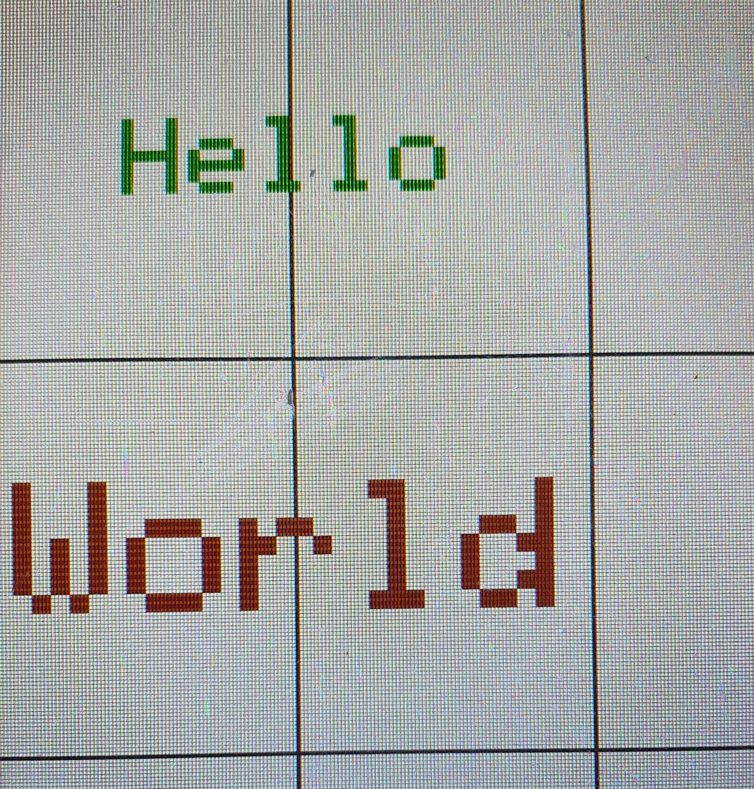

.. _textboxblank:

Textbox_Blank
++++++++++++++

Beschreibung
=============

Diese Klasse erzeugt unsichtbare Umrandungen/ Kästen für :ref:`Elemente<element>` Objekte.
Sie erbt von :ref:`Textbox<textbox>`.

Beispielbild
=====================

Diese Bild dient nur der Veranschaulichung, wie Objekte dieser Klasse aussehen können.

.. code-block:: 

    new Textbox_Blank("Hello", 3, COLOR_DARK_GREEN)
    new Textbox_Blank("World", 5, COLOR_BROWN)

Funktionen
=============

.. csv-table:: 
    :widths: 100 10000

    inline, ":ref:`Textbox_Blank<textboxblankconstructoritemstrvalue>` (const char* itemStr, ExternalTextboxValue* value=nullptr)"
    inline, ":ref:`Textbox_Blank<textboxblankconstructoritemstrcolorvalue>` (const char* itemStr, const Color& color, ExternalTextboxValue* value=nullptr)"
    inline, ":ref:`Textbox_Blank<textboxblankconstructoritemstrtextsizecolorvalue>` (const char* itemStr, const uint8_t textsize, const Color& color, ExternalTextboxValue* value=nullptr)"
    inline, ":ref:`Textbox_Blank<textboxblankconstructoritemstrtextsizevalue>` (const char* itemStr, const uint8_t textsize, ExternalTextboxValue* value=nullptr)"
    inline, ":ref:`Textbox_Blank<textboxblankconstructoritemitemstrvalue>` (Item* item, ExternalTextboxValue* value=nullptr)"
    inline void, ":ref:`draw<textboxblankdraw>` () override"
    inline void, ":ref:`loop<textboxblankdraw>` (Inputs& input) override"

Funktionen Beschreibung
=========================

.. _textboxblankconstructorItemStrValue:

inline Textbox_Blank(const char* itemStr, ExternalTextboxValue* value=nullptr)
~~~~~~~~~~~~~~~~~~~~~~~~~~~~~~~~~~~~~~~~~~~~~~~~~~~~~~~~~~~~~~~~~~~~~~~~~~~~~~~~

.. literalinclude:: ../../src/ElementViews/textbox_Blank.h
    :lines: 12-13
    :linenos:

Diese Funktion ist ein Konstruktor, der Objekte der ``Textbox_Blank`` Klasse erzeugt. Als Parameter nimmt er einen String, welches zu einem :ref:`Item<item>` umgewandelt werden soll (``itemStr``)
und dem ``value``, der angibt, in welchem Zustand sich das Objekt befindet. 

In der Initialisierungsliste erfolgt zuerst der Aufruf vom :ref:`Textbox<textboxconstructor>` Konstruktor.

.. _textboxblankconstructorItemStrColorValue:

inline Textbox_Blank(const char* itemStr, const Color& color, ExternalTextboxValue* value=nullptr)
~~~~~~~~~~~~~~~~~~~~~~~~~~~~~~~~~~~~~~~~~~~~~~~~~~~~~~~~~~~~~~~~~~~~~~~~~~~~~~~~~~~~~~~~~~~~~~~~~~~~~~~~~~~~~~~~~~~~~~~~~~~~~~~~~~~~~~~~~~~~~~~~~~~~~~~~~~~~~~~~

.. literalinclude:: ../../src/ElementViews/textbox_Blank.h
    :lines: 16-17
    :linenos:

Diese Funktion ist ein Konstruktor, der Objekte der ``Textbox_Blank`` Klasse erzeugt. Als Parameter nimmt er einen String, welches zu einem :ref:`Item<item>` umgewandelt werden soll (``itemStr``),
die Farbe des Items (``color``) und dem ``value``, der angibt, in welchem Zustand sich das Objekt befindet. 

In der Initialisierungsliste erfolgt zuerst der Aufruf vom :ref:`Textbox<textboxconstructor>` Konstruktor.

.. _textboxblankconstructorItemStrTextSizeColorValue:

inline Textbox_Blank(const char* itemStr, const uint8_t textsize, const Color& color, ExternalTextboxValue* value=nullptr)
~~~~~~~~~~~~~~~~~~~~~~~~~~~~~~~~~~~~~~~~~~~~~~~~~~~~~~~~~~~~~~~~~~~~~~~~~~~~~~~~~~~~~~~~~~~~~~~~~~~~~~~~~~~~~~~~~~~~~~~~~~~~~~~~~~~~~~~~~~~~~~~~~~~~~~~~~~~~~~~~

.. literalinclude:: ../../src/ElementViews/textbox_Blank.h
    :lines: 20-21
    :linenos:

Diese Funktion ist ein Konstruktor, der Objekte der ``Textbox_Blank`` Klasse erzeugt. Als Parameter nimmt er einen String, welches zu einem :ref:`Item<item>` umgewandelt werden soll (``itemStr``), der Schriftgröße 
(``textSize``), die Farbe des Items (``color``) und dem ``value``, der angibt, in welchem Zustand sich das Objekt befindet. 

In der Initialisierungsliste erfolgt zuerst der Aufruf vom :ref:`Textbox<textboxconstructor>` Konstruktor.

.. _textboxblankconstructorItemStrTextSizeValue:

inline Textbox_Blank(const char* itemStr, const uint8_t textsize, ExternalTextboxValue* value=nullptr)
~~~~~~~~~~~~~~~~~~~~~~~~~~~~~~~~~~~~~~~~~~~~~~~~~~~~~~~~~~~~~~~~~~~~~~~~~~~~~~~~~~~~~~~~~~~~~~~~~~~~~~~~~~~~~~~~~~~~~~~~~~~~~~~~~~~~~~~~~~~~~~~~~~~~~~~~~~~~~~~~

.. literalinclude:: ../../src/ElementViews/textbox_Blank.h
    :lines: 25-25
    :linenos:

Diese Funktion ist ein Konstruktor, der Objekte der ``Textbox_Blank`` Klasse erzeugt. Als Parameter nimmt er einen String, welches zu einem :ref:`Item<item>` umgewandelt werden soll (``itemStr``),
der Schriftgröße (``textSize``)
und dem ``value``, der angibt, in welchem Zustand sich das Objekt befindet. 

In der Initialisierungsliste erfolgt zuerst der Aufruf vom :ref:`Textbox<textboxconstructor>` Konstruktor.

.. _textboxblankconstructorItemItemStrValue:

inline Textbox_Blank(Item* item, ExternalTextboxValue* value=nullptr)
~~~~~~~~~~~~~~~~~~~~~~~~~~~~~~~~~~~~~~~~~~~~~~~~~~~~~~~~~~~~~~~~~~~~~~~~~~~~~~~~

.. literalinclude:: ../../src/ElementViews/textbox_Blank.h
    :lines: 28-29
    :linenos:

Diese Funktion ist ein Konstruktor, der Objekte der ``Textbox_Blank`` Klasse erzeugt. Als Parameter nimmt ein :ref:`Item*<item>` (``itemStr``)
und dem ``value``, der angibt, in welchem Zustand sich das Objekt befindet. 

In der Initialisierungsliste erfolgt zuerst der Aufruf vom :ref:`Textbox<textboxconstructor>` Konstruktor.

.. _textboxblankdraw:

inline void draw() override
~~~~~~~~~~~~~~~~~~~~~~~~~~~~~~~~~~~~~~~~~~~~~~~~~~~~~~~~~~~~~~~~~~~~~~~~~~~~~~~~

.. literalinclude:: ../../src/ElementViews/textbox_Blank.h
    :lines: 31-34
    :linenos:

Diese Funktion ist für das Zeichnen des Objekts zuständig.

.. literalinclude:: ../../src/ElementViews/textbox_Blank.h
    :lines: 24

Sollte ein :ref:`externalValue<externaltextboxvalue>` existieren und sollte dieses ein :ref:`value<externaltextboxvaluevvalue>` haben, 
wird dieses mit :ref:`draw<externaltextboxvaluedraw>` gezeichnet.

.. literalinclude:: ../../src/ElementViews/textbox_Blank.h
    :lines: 25

Sollte diese Bedingung aber nicht erfüllt werden, wird stattdessen :ref:`item<textboxvitem>` mit :ref:`item<displaydrawitemnocolor>` gezeichnet.

.. _textboxblankloop:

inline void loop(Inputs& input) override
~~~~~~~~~~~~~~~~~~~~~~~~~~~~~~~~~~~~~~~~~~~~~~~~~~~~~~~~~~~~~~~~~~~~~~~~~~~~~~~~

.. literalinclude:: ../../src/ElementViews/textbox_Blank.h
    :lines: 36-42
    :linenos:

Diese Funktion dient dazu, den Zustand des aktuellen Objektes zu aktualisieren, um auf Veränderungen zu reagieren.

.. literalinclude:: ../../src/ElementViews/textbox_Blank.h
    :lines: 37

Es wird geprüft, ob ein :ref:`externalValue<externaltextboxvalue>` existiert und ob dieser nicht getätigte Änderungen gespeichert hat.   

.. literalinclude:: ../../src/ElementViews/textbox_Blank.h
    :lines: 39-40

Wenn ja, wird :ref:`input.update<inputvupdate>` auf ``true`` gesetzt, da Änderungen vorzunehmen sind.
Für :ref:`externalValue<externaltextboxvalue>` wird anschließend die :ref:`resetUpdate<externaltextboxvalueresetupdate>` Funktion ausgeführt.      